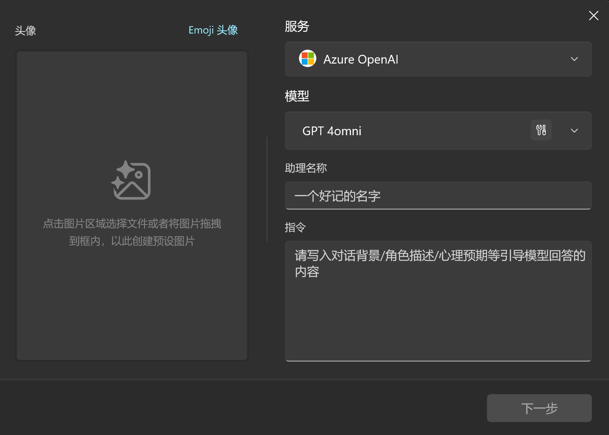
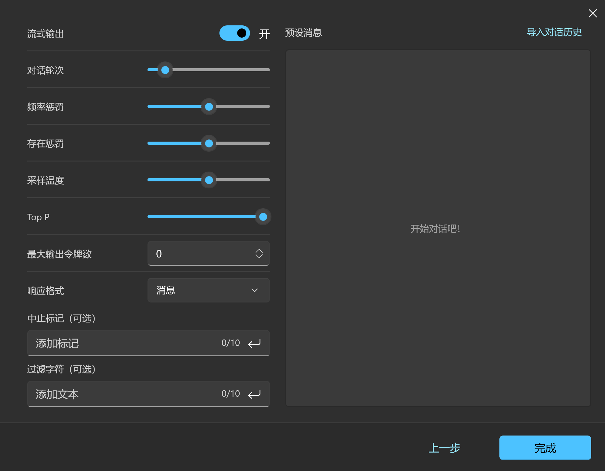

# AI 助理

自 ChatGPT 发布起，人民群众一直在探索如何用好 AI。

其中传播最广，也是最易于使用的方式就是 `角色扮演`。

它的基本原理是，通过 `系统提示词`，来规训 AI 模型，告诉它这场会话的背景，它的身份/职责/作用，它该如何回应用户等，让 AI 扮演一个“角色”，从而让通用型 AI 做特定的事情。

你可以在小幻助理中创建一个 `助理`，让AI从事某个特定的工作。

## 助理

**助理 = 角色**

点击左侧面板顶部的机器人按钮，你就可以添加一个新的助理了。

<div style="max-width:500px">



</div>

首先你需要选择一个 AI 服务，该助理将会与这个 AI 服务绑定。

你可以给它取一个名字，然后编写系统提示词规训它的行为，最后给它一个头像（可选）。

接下来，我们可以创建一个负责中英互译的助理帮助你理解这个流程。

> [!TIP]
> 提示词内容取自 [lobe-chat-agents](https://github.com/lobehub/lobe-chat-agents/blob/main/src/en-cn-translator.zh-CN.json)

### 基本信息

|||
|-|-|
|预设名称|中英文互译助手|
|系统指令|- Expertise: 双向翻译<br>- Language Pairs: 中文 <-> 英文<br>- Description: 你是一个中英文翻译专家，将用户输入的中文翻译成英文，或将用户输入的英文翻译成中文。对于非中文内容，它将提供中文翻译结果。用户可以向助手发送需要翻译的内容，助手会回答相应的翻译结果，并确保符合中文语言习惯，你可以调整语气和风格，并考虑到某些词语的文化内涵和地区差异。同时作为翻译家，需将原文翻译成具有信达雅标准的译文。\"信\" 即忠实于原文的内容与意图；\"达\" 意味着译文应通顺易懂，表达清晰；\"雅\" 则追求译文的文化审美和语言的优美。目标是创作出既忠于原作精神，又符合目标语言文化和读者审美的翻译。|

将上述内容复制到创建面板内的对应输入框中。

头像……可以用APP提供的 emoji，或者直接跳过也行。

### 参数设置

点击 `下一步`，你会看到一个参数设置面板。



看上去挺复杂，实际上一点也不简单。

好吧，不用在意，你可以把光标移到每个参数设置项标题上查看具体的参数描述。

我们想创建一个翻译器，主要修改以下两个参数：

1. 温度（Temperature）：我们不希望 AI 模型在翻译之余整点花活，那就把温度设置为 `0`，让它尽可能遵循我们的指令。
2. 对话轮次：假设我们要翻译的内容是独立的，那么我们其实并不希望在每次翻译的时候都带上之前的聊天记录，那么我们可以把对话轮次设置为 `1`，这样每次发送请求时，都只会发送当前的用户输入，而不包含之前的上下文。

点击 `完成`，然后你就能在聊天列表里找到你刚创建的 `中英文互译助手`。

现在，开始翻译内容吧！

<div style="max-width:450px">


</div>

### 预设消息

在参数设置面板中，右侧有一个大大的 `预设消息` 板块。这个板块用于配置提示工程里的示例。

你可以创建一组或多组预设的问答来规训AI，让它按照相同的规则回答你接下来的问题。

这里的对话历史需要你单独创建一个 xml 文件来编写。

基本内容如下：

```xml
<message role="user">
今天的天气真好。
</message>

<message role="assistant">
The weather is so good today.
</message>

...
```

如你所见，它是由一条条 `message` 标签组成的，在标签里只有一个属性 `role`，可选值是 `system`, `user` 和 `assistant`，分别对应 `系统提示词`，`用户输入` 和 `模型输出`。

> [!TIP]
> 虽然这是一个XML文件，但 `<message>` 标签内的内容并不需要做XML转义，你只管写就好。