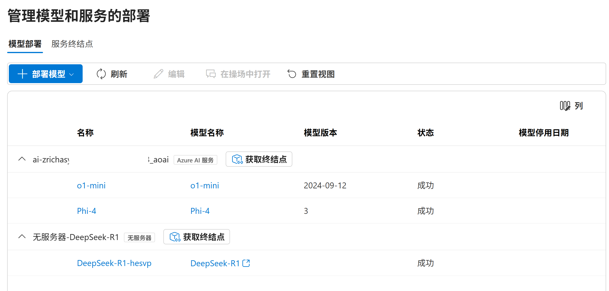
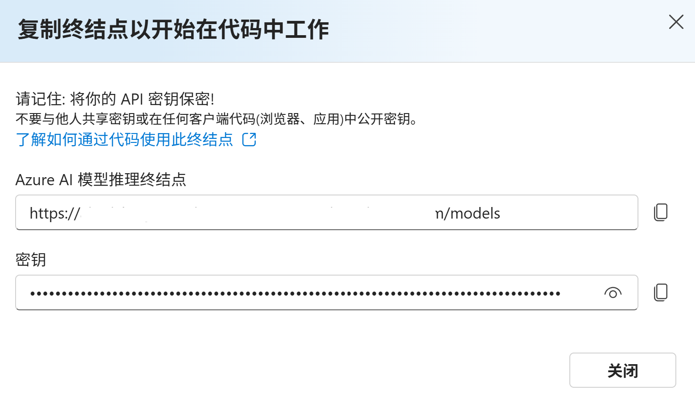
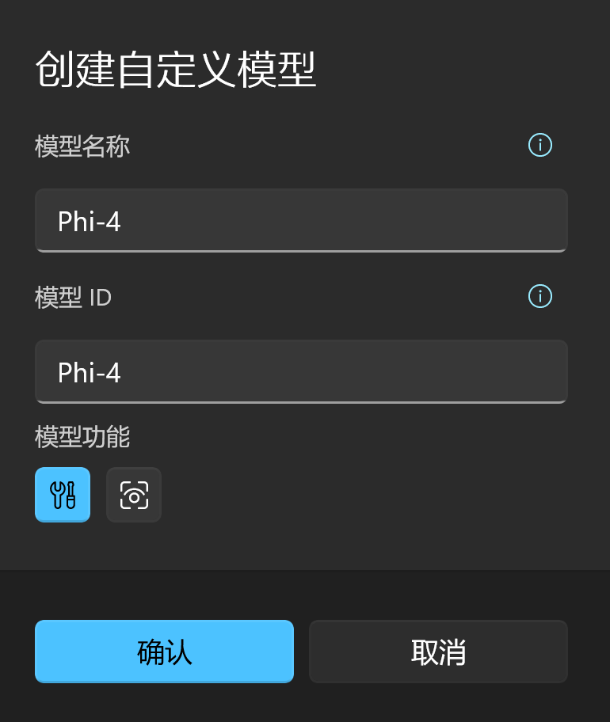

# 对话服务配置

小幻助理支持多种主流 AI 对话服务，这些服务配置各异，这篇文档会对所支持的 AI 服务如何配置进行说明。

请根据子标题索引，跳转到你想要配置的服务段落查看。

## Open AI

|文档|https://platform.openai.com/docs/api-reference/chat/create|
|-|-| 
|API 令牌|https://platform.openai.com/account/api-keys|

Open AI 的配置相对来说很简单，只要你将 API Key 填入设置中的 `访问密钥` 即可。

### 代理与 API 兼容

现在 Open AI 的接口数据结构几乎成为了一种通用标准，有很多的 AI 服务在暴露接口时为了更易用，都会选择以 Open AI 相似的接口地址和数据结构发布。这就是所谓的 `Open AI 兼容接口`。

如果你正在使用的 AI 服务不在小幻助理的支持列表中，但又恰好使用了 Open AI 兼容接口，那么你就可以把该服务的地址写入 Open AI 设置区块的 `终结点（API）` 文本框中。

当然，还有另一种使用场景。

由于 Open AI 在部分国家或地区不可用，用户会尝试以代理服务器的方式使用 Open AI 服务，比如 [Open AI API Proxy](https://www.openai-proxy.com/)。

你依然需要使用自己的 API 密钥，但不直接访问 OpenAI 服务器，而是交由代理服务进行访问，从而避免被墙或者封号。

你可以将对应的服务地址填入 `终结点（API）` 中，以实现 API 代理功能。比如上面的代理服务，需要填入的地址就是：`https://api.openai-proxy.com/v1`

> [!WARNING]
> 上文提到的 Open AI API Proxy 仅用作说明该使用场景，开发者不对其安全性负责，使用者需要自行辨别服务的可靠性并为之负责。

> [!TIP]
> 对于代理来说，版本号通常是有必要的，比如 `https://api.openai-proxy.com/v1` 中的 `v1`。
> 因为 API 输入框还需要兼容其它 API 服务，有些服务并不见得会在请求路径中使用版本号。

## Azure Open AI

|文档|https://learn.microsoft.com/azure/ai-services/openai/overview|
|-|-| 
|Azure 服务|https://azure.microsoft.com/en-us/products/ai-services/openai-service|

Microsoft 与 Open AI 的关系较为特殊，有种 Open AI 特许经销商的感觉，所以你能够在 Azure 这个云服务平台创建 Open AI 资源，并按需部署 `GPT 4` , `GPT 4o` 等 Open AI 模型。

虽然它们的模型一致，但是网络请求格式却不尽相同，所需要的配置项也不一样。

当你部署了 Open AI 资源后，你能在资源页面的 `资源管理` -> `密钥和终结点` 中找到所需的密钥（两个密钥任选其一即可）与终结点。

<div style="max-width: 500px">


</div>

将对应的值填入应用设置中。

你可能会对 API 版本感到好奇，这里是 [文档](https://learn.microsoft.com/azure/ai-services/openai/reference#completions)，通常情况下不需要改动。

### 添加自定义模型

Azure Open AI 相较于 Open AI，最大的不同在于你需要手动部署需要的模型。

在应用中，Azure Open AI 不提供预置模型，仅仅填写密钥和终结点并不能让配置生效，我们还需要创建自定义模型。

在 [Azure OpenAI Studio](https://) 中，你可以从模型库里部署特定的模型。

每个模型有自己的 Id，比如 GPT 3.5 Turbo 的 Id 就是 gpt-35-turbo。

<div style="max-width: 420px">


</div>

在你部署模型时，Azure 会要求你提供 **部署名**，这个很重要，我们通过 API 与服务进行交互式，模型的标识符不是模型 ID，而是你部署模型时的部署名。

我推荐在部署模型时尽量使用和模型 ID 相同的部署名，以减少歧义。但也存在例外情况，比如你部署了多个 `gpt 3.5 turbo`，但是它们的模型版本不同，那么你的部署名可能会是 `gpt-35-turbo-1106` 或 `gpt-35-turbo-0613`，那么在应用中创建自定义模型时，你可以按下图所示创建：

<div style="max-width: 300px">


</div>

## Azure AI Foundry

Azure 提供了完善的 AI 模型分发服务——Azure AI Foundry。

假设你已经在 Azure AI Foundry 中创建了自己的项目，那么请在侧边栏中点击 `我的资产 / 模型 + 终结点`



需要注意的是，Azure AI Foundry 中部署的模型是有分类的，你能在上图中看到两种类型。

那么在填写应用内配置时，模型和分类一定要匹配才行。

比如现在我们要在应用内添加 `Phi-4` 模型，那就按如下步骤操作：

1. 点击上图中 `Phi-4` 所属分类的 `获取终结点` 按钮。  
   
2. 将终结点和密钥复制到应用对应的输入框中。
3. 创建自定义模型，模型 ID 对应你的部署名称（第一列的 `名称`）  
   

## Gemini

|文档|https://ai.google.dev/gemini-api/docs|
|-|-| 
|API 令牌|https://ai.google.dev/gemini-api/docs/api-key|

和 [Open AI](#open-ai) 类似，获取访问密钥后，将其填入 `访问密钥` 中即可。

### 代理

Gemini 作为谷歌提供的 AI 服务，国内用户如果要访问，也可能需要代理，这一点和 [OpenAI](#open-ai) 是一致的，请参考 Open AI 的配置方式，配置 Gemini 的代理服务。需要注意的是，Gemini 中的代理终结点不要加版本号，目前应用使用 `v1-beta`。

## Anthropic

|文档|https://docs.anthropic.com/zh-CN/docs/intro-to-claude|
|-|-| 
|API 令牌|https://console.anthropic.com/account/keys|

和 [Open AI](#open-ai) 类似，获取访问密钥后，将其填入 `访问密钥` 中即可。

## 月之暗面

即 Moonshot。

|文档|https://platform.moonshot.cn/docs/api/chat#api-%E8%AF%B4%E6%98%8E|
|-|-| 
|API 令牌|https://platform.moonshot.cn/console/api-keys|

和 [Open AI](#open-ai) 类似，获取访问密钥后，将其填入 `访问密钥` 中即可。

## 智谱 AI

ChatGLM 即出于此。

|文档|https://open.bigmodel.cn/dev/howuse/introduction|
|-|-| 
|API 令牌|https://open.bigmodel.cn/usercenter/apikeys|

和 [Open AI](#open-ai) 类似，获取访问密钥后，将其填入 `访问密钥` 中即可。

## 零一万物

|文档|https://platform.lingyiwanwu.com/docs|
|-|-| 
|API 令牌|https://platform.lingyiwanwu.com/apikeys|

和 [Open AI](#open-ai) 类似，获取访问密钥后，将其填入 `访问密钥` 中即可。

## DeepSeek

|文档|https://platform.deepseek.com/api-docs/zh-cn|
|-|-| 
|API 令牌|https://platform.deepseek.com/api_keys|

和 [Open AI](#open-ai) 类似，获取访问密钥后，将其填入 `访问密钥` 中即可。

## 通义千问

|文档|https://help.aliyun.com/zh/model-studio/developer-reference/use-qwen-by-calling-api|
|-|-| 
|API 令牌|https://help.aliyun.com/zh/model-studio/developer-reference/get-api-key|

通义千问是阿里公开的大语言模型，它托管在阿里云的大模型服务平台百炼，所以这要求你注册并开通阿里云百炼平台的模型服务。

百炼平台本身是有自己的 API 接口和数据结构的，但是比较好的一点是，它同时提供了 Open AI 适配接口，小幻助理在这里直接使用了百炼提供的适配接口，即：

`https://dashscope.aliyuncs.com/compatible-mode/v1`

所以它支持的模型是有限的，具体参考这篇文档：[OpenAI接口兼容](https://help.aliyun.com/zh/dashscope/developer-reference/compatibility-of-openai-with-dashscope/)

## 文心一言

|文档|https://cloud.baidu.com/doc/WENXINWORKSHOP/s/fm4tsw9nv|
|-|-| 
|API 令牌|https://console.bce.baidu.com/iam/#/iam/accesslist|

文心一言是百度提供的大语言模型，它托管在百度云的千帆大模型平台。它有着自己的托管步骤，甚至对于不同的模型需要单独开通服务，这一点请在其文档中查阅。

我个人很难评价百度千帆的文档，只能说它是这20多个服务里最具误导性的，我在集成文心一言的过程中几度想要放弃。所以如果你想省点事儿，最好直接点击 [API 令牌](https://console.bce.baidu.com/iam/#/iam/accesslist) 链接，然后创建 Access Key，将 Access Key 和 Secret Key 分别填到应用的 `访问密钥` 和 `密文密钥` 中即可。

不要去管 API 文档里的什么 `API Key`，`注册应用` 之类杂七杂八的鬼东西。

## 腾讯混元

|文档|https://cloud.tencent.com/document/product/1729/105701|
|-|-| 
|API 令牌|https://cloud.tencent.com/document/product/1729/111008|

混元大模型托管在腾讯云上，比较好的一点是它提供了 Open AI 的兼容接口，小幻阅读就可以直接集成了。

你可以创建 [API Key](https://console.cloud.tencent.com/hunyuan/start)，然后将密钥填入小幻助理的访问密钥中即可。

## 讯飞星火

|文档|https://www.xfyun.cn/doc/spark/Web.html|
|-|-| 
|API 令牌|https://console.xfyun.cn/services/bm35|

星火大模型是科大讯飞推出的大语言模型，在使用该模型家族前，你需要在 [讯飞开放平台](https://www.xfyun.cn/) 先注册一个应用，然后开通对应的模型服务。

未开通的模型将无法使用。

注册后，你能在 `星火认知大模型` 的模型页中找到 `服务接口认证信息`。

小幻助理采用 http 服务，你只需要将对应模型的 `APIPassword` 填入到小幻助理的 `访问密钥` 中即可。

## 字节豆包

|文档|https://www.volcengine.com/docs/82379/1263482|
|-|-|
|API 令牌|https://console.volcengine.com/ark/region:ark+cn-beijing/apiKey|

豆包大模型是字节跳动推出的大语言模型，在使用该模型前，你需要在 [火山引擎](https://www.volcengine.com/) 注册账户，然后在火山方舟的模型推理页面 [创建推理接入点](https://www.volcengine.com/docs/82379/1099522).

你必须手动部署模型接入点，火山引擎没有提供预设的推理接入点。

之后，你需要在 [API Key 管理](https://console.volcengine.com/ark/region:ark+cn-beijing/apiKey) 中创建一个 API Key，将其填入应用中的设置项。

### 自定义模型

请参照 [创建推理接入点](https://www.volcengine.com/docs/82379/1099522) 先部署模型。

然后在应用中点击创建自定义模型，将推理接入点 ID（ep-xxxxxxx）粘贴进模型 ID，然后给自定义模型取一个易读的名称，这样就创建好了一个自定义模型，然后就可以开始和这个模型聊天了。

## Silicon Flow

|文档|https://docs.siliconflow.cn/quickstart|
|-|-| 
|API 令牌|https://docs.siliconflow.cn/docs/4-api%E8%B0%83%E7%94%A8|

和 [Open AI](#open-ai) 类似，获取访问密钥后，将其填入 `访问密钥` 中即可。

## OpenRouter

|文档|https://openrouter.ai/docs/quick-start|
|-|-| 
|API 令牌|https://openrouter.ai/keys|

和 [Open AI](#open-ai) 类似，获取访问密钥后，将其填入 `访问密钥` 中即可。

## Together AI

|文档|https://docs.together.ai/docs/quickstart|
|-|-| 
|API 令牌|https://api.together.xyz/settings/api-keys|

和 [Open AI](#open-ai) 类似，获取访问密钥后，将其填入 `访问密钥` 中即可。

## Groq

|文档|https://console.groq.com/docs/quickstart|
|-|-| 
|API 令牌|https://console.groq.com/keys|

和 [Open AI](#open-ai) 类似，获取访问密钥后，将其填入 `访问密钥` 中即可。

## Perplexity

|文档|https://docs.perplexity.ai/docs/getting-started|
|-|-| 
|API 令牌|https://www.perplexity.ai/settings/api|

和 [Open AI](#open-ai) 类似，获取访问密钥后，将其填入 `访问密钥` 中即可。

## Mistral AI

|文档|https://docs.mistral.ai/|
|-|-| 
|API 令牌|https://console.mistral.ai/api-keys/|
|Costral 令牌|https://console.mistral.ai/codestral|

和 [Open AI](#open-ai) 类似，获取访问密钥后，将其填入 `访问密钥` 中即可。

Mistral 还提供了 `Codestral` 服务，这个服务是免费的（至少 2025/03/22 还是免费的），主要用于代码生成（当然也可以对话）。

因为它们所使用的 API 不同，小幻助理单独为 Codestral 提供了一个密钥位置。如果你需要使用 Codestral，请在输入 Codestral 密钥后打开 `使用 Codestral` 的开关，然后在调用模型时选择 Codestral 即可。

## Ollama

|文档|https://github.com/ollama/ollama/blob/main/README.md#quickstart|
|-|-| 
|服务地址|默认为 `http://localhost:11434/v1`|

Ollama 是一个热门的本地模型托管服务，它自身的使用已经足够写一篇万余字的文档，这里不再赘述，请自行学习。

小幻助理支持以 API 接口的形式访问 Ollama，Ollama 提供了 Open AI 适配接口，使得小幻助理可以简单地接入。

相应的，由于是在本地运行大模型，应用没有内置任何初始模型，你需要根据当前 ollama 已经拉取到本地的模型创建自定义模型。

### 创建自定义模型

假设你刚刚安装 ollama，并打算运行 `Qwen 2`（通义千问 2） 大模型，你需要按如下步骤操作：

1. 通过 ollama 拉取模型到本地（这里以 [qwen2 0.5b](https://ollama.com/library/qwen2:0.5b) 举例）
    ```shell
    ollama pull qwen2:0.5b
    ```

2. 调用以下命令确认模型已经下载到本地：
    ```shell
    ollama list
    ```
    它应该返回类似下面的内容：
    ```shell
    NAME                    ID              SIZE    MODIFIED
    qwen2:0.5b              6f48b936a09f    352 MB  36 seconds ago
    ```

3. 在应用中根据模型名称创建自定义模型：
    <div style="max-width: 300px">

    

    </div>

## xAI

|文档|https://docs.x.ai/docs/overview|
|-|-| 
|API 令牌|https://console.x.ai/team/default/api-keys|

和 [Open AI](#open-ai) 类似，获取访问密钥后，将其填入 `访问密钥` 中即可。