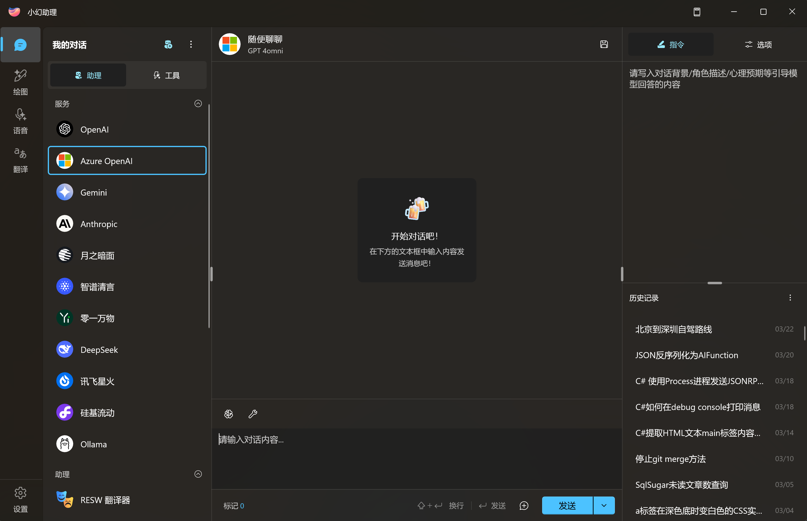
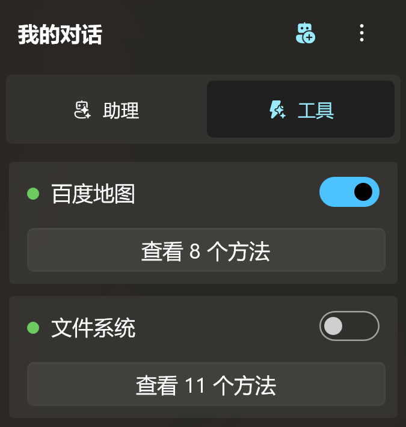
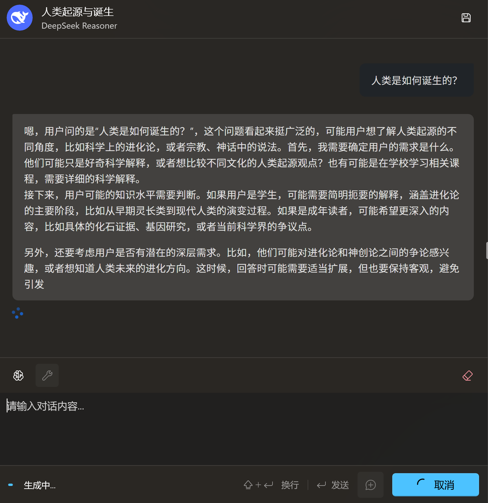
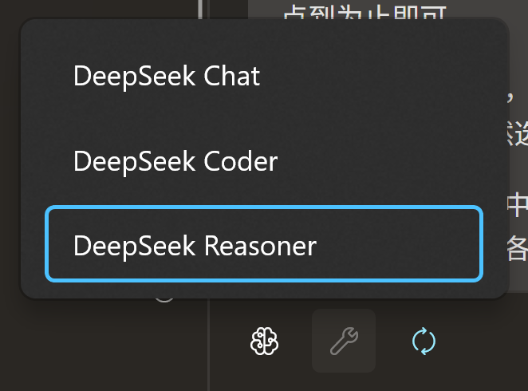
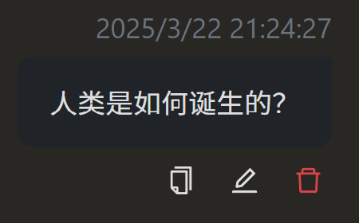
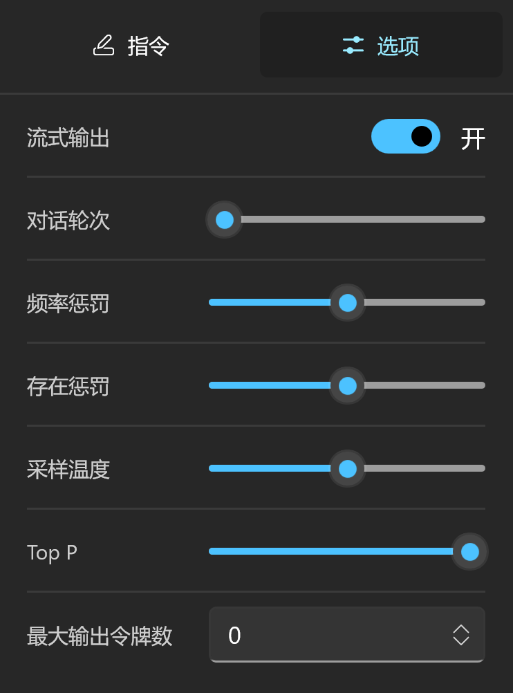

# 开始对话

在完成 [对话服务配置](./chat-config) 之后，现在你可以在侧边栏进入聊天界面。

## 快速开始

***在左侧选中一个可用的 AI 服务，然后就可以在聊天框中输入内容，与 AI 开始对话了。***

接下来，我们就大概介绍一下这个聊天界面。

在对话界面左侧，有两个主要的功能区块：`助理` 和 `工具`，先看助理。

## 助理面板

### 服务

在进行对话配置时，你可能会配置多个 AI 服务以满足不同的需求。

应用会在左侧展示已经配置完成的 AI 对话服务，你可以选择某个服务，然后开始对话。

### 助理

除了服务外，你还可以调用助理。

比如截图中显示的 `RESW 翻译器`，就是特定用于进行resw文件翻译的 AI 助理。

如果你想了解更多关于助理的内容，请阅读 [AI 助理](./agent-preset)。

### 群组

当你拥有两个及以上的助理后，你就能把它们拉到一个群组里，你做老大，给他们布置一个目标，然后集思广益，让模型们配合工作。

## 工具面板

AI 发展至今，主流的 AI 服务及模型基本上都支持工具调用（Tool Call）。

与部署在云端的 AI 服务不同，小幻助理作为一个 Windows 原生应用，可以很方便地跑本地代码。

所以，小幻助理接入了最近非常流行的 [模型上下文协议（MCP）](https://docs.mcpcn.org/introduction)，借此无缝集成大量的 MCP 工具。

如果你已经拥有了一个 MCP 工具集，那么恭喜你，你可以直接导入到小幻助理中使用。

## 聊天面板

当你选中左侧面板中的某个 `服务` / `助理` / `群组` 后，应用就会加载聊天面板。

这个界面我想你是比较熟悉的了，平常我们所使用的聊天工具基本都长这个样子。

你可以在下方输入文本内容，按下 `Enter` 键发送，等待 AI 响应。

### 切换模型

AI 服务一般都会提供多个模型，如果你想在不同模型间切换，请点击聊天工具栏左侧第一个长得像大脑的图标，然后你就可以切换不同的模型了。

### 消息工具

小幻助理支持对聊天历史中的每条消息单独操作。

将光标移动到消息上，你就能看到消息工具条，你可以 `复制` / `修改` / `删除`。

这可以帮助你更精细地调整 AI 的输出。

> [!DANGER]
> 需要注意的是，有些 AI 服务对消息历史有着较为严格的要求，必须要一条用户消息，一条AI消息这样交错提交（比如 [文心一言](https://cloud.baidu.com/doc/WENXINWORKSHOP/s/clntwmv7t#body%E5%8F%82%E6%95%B0)）。如果你删除了某条消息，可能会导致 AI 服务生成失败。

## 管理面板

在界面右侧的是管理面板。

它被分割成了两个部分。

### 控制面板

上面的部分是针对当前会话的控制面板。

你可以在这里输入系统提示词，或者切换到 `会话选项`，从数值层面调整 AI 行为。

> [!TIP]
> 会话选项会根据当前 AI 服务的不同而有所变化。对于 “类 Open AI 服务”，会统一应用 Open AI 的参数选项，但这并不意味着所有参数都能被正确处理，这仰赖具体服务的能力。

### 会话列表

管理面板下部是会话列表管理。

需要注意的是，这里的会话列表不是全部会话列表，而是根据当前选择的 `服务` / `助理` / `群组` 动态显示的分组列表。

也就意味着，你在 Open AI 的聊天会话将不会显示在 Azure Open AI 的会话列表中。

这可以更好地分类会话，避免混乱。但同时也会引入一个问题，那就是对会话记录的索引可能会比较困难。

故而后续会推出全局会话内容搜索的功能以解决这个问题。（TBD）

#### 会话重命名

对于一个新的会话，它的名称是 `随便聊聊`，但有时候我们不希望列表里全是随便聊聊。

为了便于我们会历史会话进行管理，我们就需要对会话标题进行重命名。

你可以右键单击某个会话，在菜单中有两个重命名选项：

- 重命名
- 智能重命名

重命名自不必说，你可以手动更改会话标题。

智能重命名则是根据会话里的第一条消息，让 AI 自行撰写标题。

> [!TIP]
> 智能重命名时，所调用的 AI 服务即当前聊天的 AI 服务，所以名称是否贴切，这个就看模型本身的能力了。
>
> 同时因为会话重命名本身是一次对 AI 的调用，会占用 Token，所以是手动触发而不是自动重命名。

如果你觉得手动重命名太过麻烦，可以在设置里开启 `对话自动重命名`