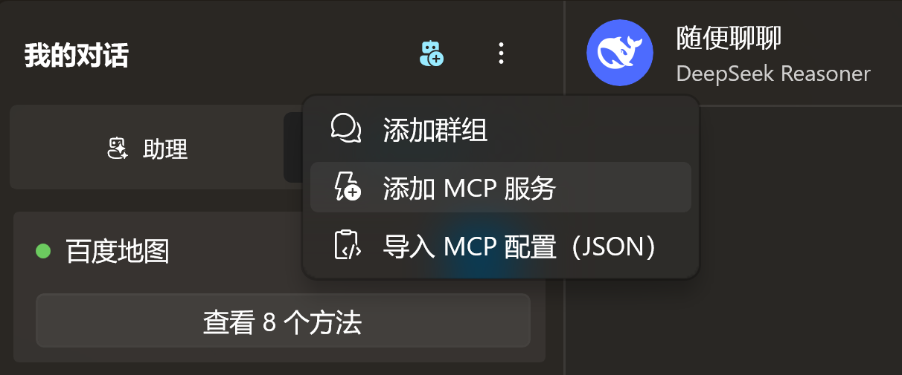
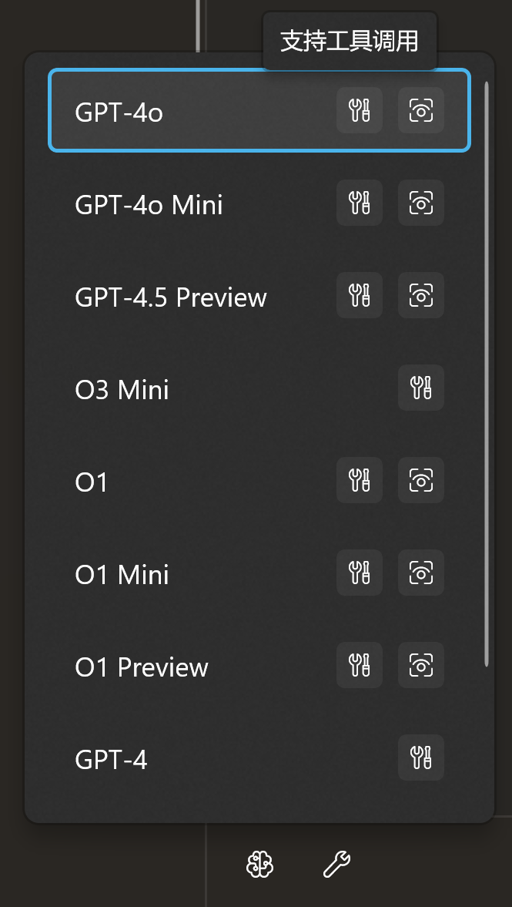
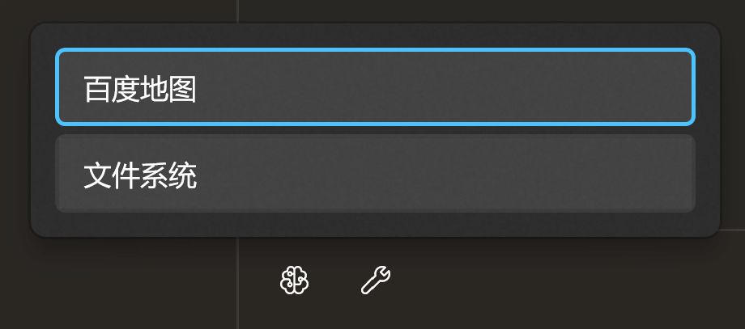

# 工具调用

小幻助理支持标准的工具调用流程：

1. 将提示词与工具集定义一起发送给大语言模型。
2. 模型根据提示词判定是否需要使用工具。
    - 如果需要，则返回工具名称。
        1. 应用调用指定名称的工具（函数）
        2. 将返回值回传给模型
        3. 模型综合提示词和工具调用结果给出响应。
    - 如果不需要，直接生成响应。
3. 应用显示最终的模型响应。

举例来说，你知道的，大语言模型通常不具备联网能力，无法回答实时性问题。

比如今天某个城市的天气如何。

但是模型可以调用指定的工具去获取最新的天气信息，然后根据天气信息返回你需要的答案。

## 导入工具插件

在小幻助理的聊天界面，你可以在左侧面板顶部的溢出菜单中找到导入插件的功能入口。

小幻助理的插件包实际上就是一个 zip 压缩包，具体如何创建，请参考 [插件开发](./tool-dev)

导入后，在你的工作目录下会有一个 Plugins 文件夹，里面存放着解压后的插件文件。

## 模型支持

工具调用需要模型支持，比如 Open AI 中，GPT-3.5 Turbo 支持工具调用，但是 GPT-4 Vision Preview 就不支持。

如果想查看该模型是否支持工具调用，请确认该模型具有工具图标。

对于自定义模型，如果你确认该模型是支持工具调用的，可以在创建时勾选工具调用功能。

## 使用工具

在聊天界面中，你需要先切换到支持工具调用的模型，然后在工具栏中点击按钮，勾选需要使用的插件。

> [!TIP]
> 原则上不应勾选太多的插件，因为往往一个插件中包含多个方法，每个方法的说明也会占据上下文窗口长度。

当插件勾选完成，且模型支持工具调用，那么你就可以提问了。

假设你的工具支持查询天气信息，那么你就可以问 `今天 XXX 天气怎么样？` 之类的问题，模型会自动调用工具进行解答。

