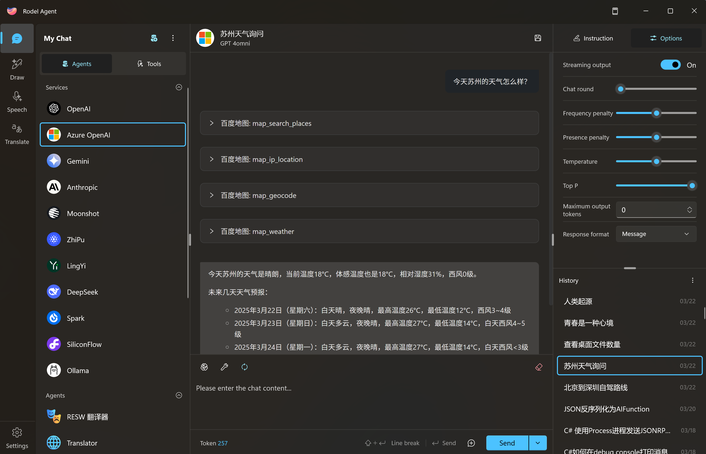

# About Rodel Agent

## What is it?

Rodel Agent supports mainstream AI services available on the market, not limited to chat functionalities, and mainly supports the following features:

- Chat (with MCP support)
- Text-to-image generation
- Text-to-speech conversion
- Machine translation
- (Pending features)

## Why Choose Rodel Agent?

You don't necessarily have to choose Rodel Agent.

You can try out a few options and make your own judgment.

Maybe it's because of the simple installation process, maybe because of the clean and Fluent Design-compliant interface, or maybe you just trust the applications I develop.

It's up to you.

Rodel Agent is just one of your choices. Use it freely as long as it helps you.

## Vision

To create a simple and user-friendly wrapper application, integrating as many AI services as possible under a unified UI for your convenience in daily use, that would be enough.

> [!TIP]
> For me personally,
>
> I actually want to implement all the features of the current mainstream AI wrapper applications. It's a good learning and practice project.

## Disclaimer

Rodel Agent encapsulates commonly used AI services and provides an easy-to-use UI (commonly referred to as a wrapper application).

To avoid legal risks in the country of operation, Rodel Agent will not provide built-in AI services to users, nor will it collect data on user interactions with AI.

Therefore, the AI services you use, such as OpenAI, Azure, etc., will need to be registered and paid for by yourself.

The developer (Richasy) will not be responsible for the content generated through these services.

> [!WARNING]
> If the content generated by AI services contains false, deceptive, offensive, political, or pornographic material, please remember, this has nothing to do with Rodel Agent.