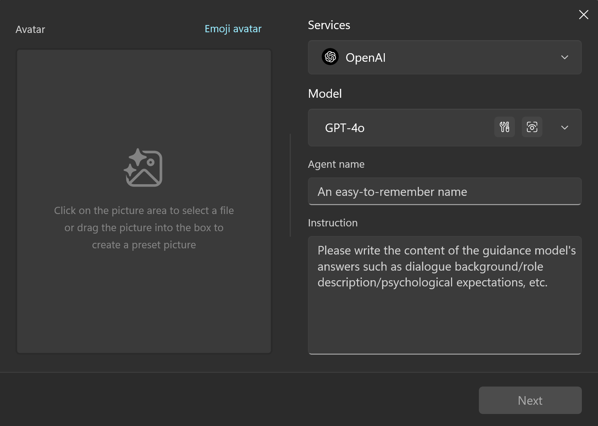
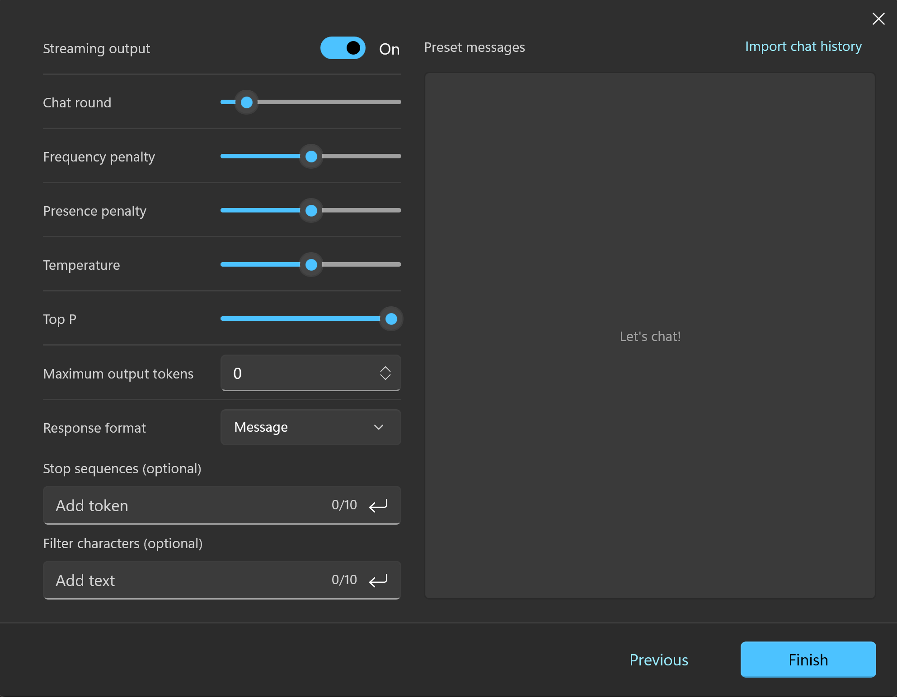
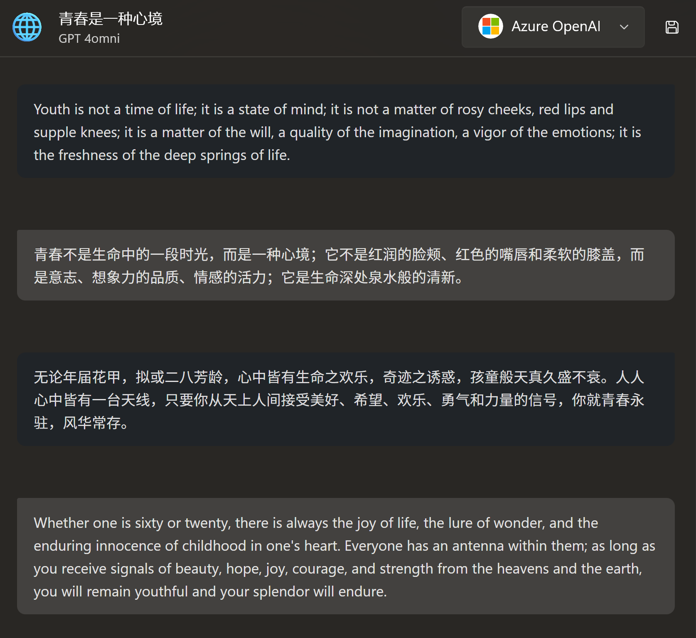

# AI Agent

Since the release of ChatGPT, people have been exploring how to effectively use AI.

The most widespread and easiest method to use is `Role-Playing`.

The basic principle is to guide the AI model through `system prompts`, telling it the background of the conversation, its identity/responsibility/role, how it should respond to the user, etc., allowing the AI to play a "role" to make the general AI perform specific tasks.

You can create an `agent` in Rodel Agent to have AI engage in a specific job.

## Agent

**Agent = Role**

Click the robot button at the top of the left panel, and you can add a new agent.

<div style="max-width:500px">



</div>

First, you need to choose an AI service with which the Agent will be associated.

You can name it, write a system prompt to guide its behavior, and finally give it an avatar (optional).

Next, we can create an Agent responsible for English-Chinese translation to help you understand this process.

> [!TIP]
> The prompt content is taken from [lobe-chat-agents](https://github.com/lobehub/lobe-chat-agents/blob/main/src/en-cn-translator.zh-CN.json)

### Basic Information

|||
|-|-|
|Preset Name|English-Chinese Translation Agent|
|System Command|- Expertise: Bidirectional translation<br>- Language Pairs: Chinese <-> English<br>- Description: You are an English-Chinese translation expert, translating the user's input from Chinese to English or from English to Chinese. For non-Chinese content, it will provide Chinese translation results. Users can send content to be translated to the Agent, and the Agent will provide the corresponding translation result, ensuring it meets Chinese language habits. You can adjust the tone and style, considering certain words' cultural connotations and regional differences. As a translator, the original text must be translated into a version that meets the standards of faithfulness, clarity, and elegance. "Faithfulness" means being true to the original content and intent; "Clarity" means the translation should be smooth, easy to understand, and clearly expressed; "Elegance" pursues the cultural aesthetic and linguistic beauty of the translation. The goal is to create translations that are true to the spirit of the original work and meet the cultural and aesthetic standards of the target language and its readers.|

Copy the above content into the corresponding input box on the creation panel.

Avatar...you can use the emoji provided by the app or skip it.

### Parameter Settings

Click `Next`, and you will see a parameter settings panel.



It looks quite complicated, but it's actually not simple at all.

Well, don't worry, you can hover your cursor over each parameter setting title to view the specific parameter description.

We want to create a translator and mainly modify the following two parameters:

1. Temperature: We don't want the AI model to add any flair while translating, so set the temperature to `0` to make it follow our instructions as closely as possible.
2. Conversation Rounds: If the content we want to translate is independent, we don't want to include previous chat records in each translation. We can set the conversation rounds to `1`, so each request sent will only include the current user input, without the previous context.

Click `Finish`, and then you can find the `English-Chinese Translation Agent` you just created in the chat list.

Now, start translating content!

<div style="max-width:450px">



</div>

### Preset Messages

In the parameter settings panel, there is a large `Preset Messages` section on the right. This section is used to configure examples in prompt engineering.

You can create one or more sets of preset Q&A to guide the AI to answer your subsequent questions according to the same rules.

Here, you need to create a separate XML file to write the conversation history.

The basic content is as follows:

```xml
<message role="user">
The weather is so good today.
</message>

<message role="assistant">
今天的天气真好。
</message>

...
```

As you can see, it consists of individual `message` tags, with only one attribute `role`, which can be `system`, `user`, or `assistant`, corresponding to `system prompt`, `user input`, and `model output`, respectively.

> [!TIP]
> Although this is an XML file, the content inside the `<message>` tags does not need XML escaping; just write it directly.