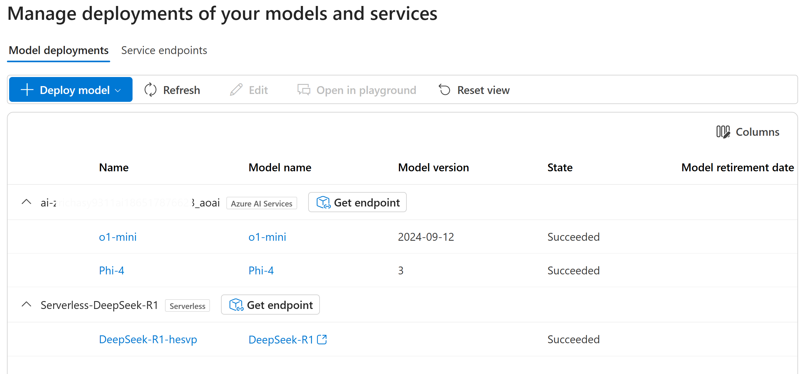
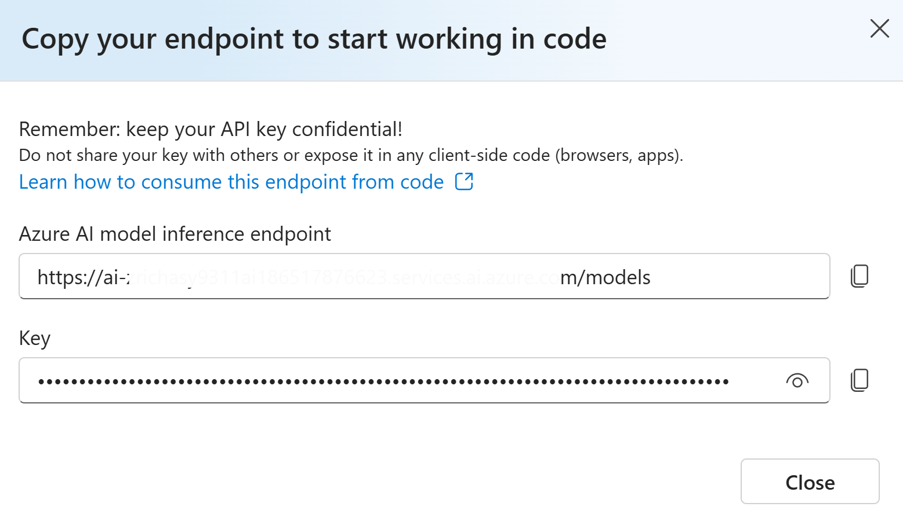
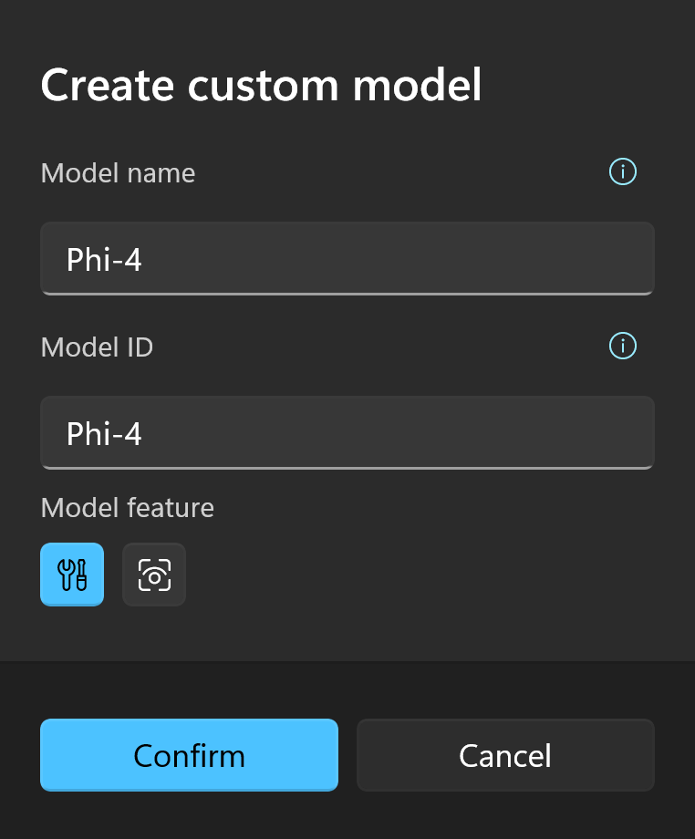

# Configuration of Chat Services

Rodel Agent supports a variety of mainstream AI chat services with different configurations. This document explains how to configure the supported AI services. 

Please use the subsection index to navigate to the segment for the service you want to configure.

## OpenAI
 
|Documentation|https://platform.openai.com/docs/api-reference/chat/create|
|-|-|  
|API Token|https://platform.openai.com/account/api-keys|  

Configuring OpenAI is relatively simple. You just need to input your API Key in the `Access Key` field of the settings.

### Proxy and API Compatibility

Currently, the OpenAI interface data structure has become a de facto standard. Many AI services expose their interfaces by adopting similar address and data structures to OpenAI for easier usage. This is referred to as the `OpenAI-compatible interface`.

If the AI service you are using is not listed in Rodel Agent's support list but uses an OpenAI-compatible interface, you can input the service's address in the `Endpoint (API)` text box of the OpenAI settings block.

Another usage scenario involves using OpenAI services through a proxy server due to inaccessibility in some countries or regions, such as [OpenAI API Proxy](https://www.openai-proxy.com/).

In this case, you still need to use your own API key, but instead of directly accessing the OpenAI server, you use a proxy service to avoid restrictions or bans.

You can input the service address in the `Endpoint (API)` field to achieve API proxy functionality. For example, for the proxy service mentioned above, you need to input the address: `https://api.openai-proxy.com/v1`.

> [!WARNING]  
> The OpenAI API Proxy mentioned above is provided for illustration purposes only. The developer does not take responsibility for its security. Users need to independently evaluate the reliability of the service and take responsibility for its usage.

> [!TIP]  
> For proxies, including a version number is usually necessary, such as `v1` in `https://api.openai-proxy.com/v1`. Because the API input field needs to be compatible with other API services, some services might not use a version number in the request path.

## Azure OpenAI

|Documentation|https://learn.microsoft.com/azure/ai-services/openai/overview|  
|-|-| 
|Azure Services|https://azure.microsoft.com/en-us/products/ai-services/openai-service|  

Microsoft has a special relationship with OpenAI, akin to an authorized dealer, allowing you to create OpenAI resources on the Azure cloud service platform and deploy models such as `GPT-3.5` and `GPT-4o` as needed.

Though their models are consistent, the network request formats and required configuration items differ.

After deploying OpenAI resources, you can find the required keys (either one of the two keys) and endpoint in the resource page under `Resource Management` -> `Keys and Endpoints`.

<div style="max-width: 500px">  

  

</div>

Input the corresponding values in the application settings.

You might be curious about the API version; here is the [documentation](https://learn.microsoft.com/azure/ai-services/openai/reference#completions). Generally, it doesn't need to be changed.

### Adding Custom Models

Compared to OpenAI, Azure OpenAI requires manual deployment of the needed models.

In the application, Azure OpenAI does not provide pre-configured models. Simply filling in the keys and endpoints will not make the configuration effective; we also need to create custom models.

In the [Azure OpenAI Studio](https://), you can deploy specific models from the model library.

Each model has its own Id, for instance, the Id for GPT-3.5 Turbo is gpt-35-turbo.

<div style="max-width: 420px">  

  

</div>

When deploying a model, Azure requires you to provide a **Deployment Name**, which is crucial. When interacting with the service through the API, the model identifier is not the model ID but the deployment name you provided during the model deployment.

It is recommended to use the same name as the model ID during deployment to avoid confusion. However, exceptions may occur, such as when you deploy multiple `GPT-3.5 Turbo` models with different versions. In that case, your deployment names might be `gpt-35-turbo-1106` or `gpt-35-turbo-0613`. When creating a custom model in the application, you can do it as shown below:

<div style="max-width: 300px">  

  

</div>

## Azure AI Foundry

Azure offers a comprehensive AI model distribution service—[Azure AI Foundry](https://ai.azure.com/).

Assuming you have already created your project in Azure AI Foundry, click on `My assets / Models + endpoints` in the sidebar.



It is important to note that the models deployed in Azure AI Foundry are categorized, and you can see two types in the image above.

When filling in the application configuration, the model and category must match.

For example, if we want to add the `Phi-4` model to the application, follow these steps:

1. Click the `Get endpoint` button in the category to which `Phi-4` belongs in the image above.  
   
2. Copy the endpoint and key to the corresponding input box in the application.
3. Create a custom model, where the model ID corresponds to your deployment name (the `Name` in the first column).  
   

## Gemini

|Documentation|https://ai.google.dev/gemini-api/docs|  
|-|-| 
|API Token|https://ai.google.dev/gemini-api/docs/api-key|  

Similar to [OpenAI](#open-ai), after obtaining the access key, fill it in the `Access Key` field.

## Anthropic

|Documentation|https://docs.anthropic.com/zh-CN/docs/intro-to-claude|  
|-|-| 
|API Token|https://console.anthropic.com/account/keys|  

Similar to [OpenAI](#open-ai), after obtaining the access key, fill it in the `Access Key` field.

## Moonshot

|Documentation|https://platform.moonshot.cn/docs/api/chat#api-%E8%AF%B4%E6%98%8E|  
|-|-| 
|API Token|https://platform.moonshot.cn/console/api-keys|  

Similar to [OpenAI](#open-ai), after obtaining the access key, fill it in the `Access Key` field.

## Zhipu AI

ChatGLM is from here.

|Documentation|https://open.bigmodel.cn/dev/howuse/introduction|  
|-|-| 
|API Token|https://open.bigmodel.cn/usercenter/apikeys|  

Similar to [OpenAI](#open-ai), after obtaining the access key, fill it in the `Access Key` field.

## 01.AI

|Documentation|https://platform.lingyiwanwu.com/docs|  
|-|-| 
|API Token|https://platform.lingyiwanwu.com/apikeys|  

Similar to [OpenAI](#open-ai), after obtaining the access key, fill it in the `Access Key` field.

## DeepSeek
 
|Documentation|https://platform.deepseek.com/api-docs/zh-cn|  
|-|-| 
|API Token|https://platform.deepseek.com/api_keys|  

Similar to [OpenAI](#open-ai), after obtaining the access key, fill it in the `Access Key` field.

## Qwen

|Documentation|https://help.aliyun.com/zh/model-studio/developer-reference/use-qwen-by-calling-api|
|-|-|
|API Token|https://help.aliyun.com/zh/model-studio/developer-reference/get-api-key|

Qwen is a publicly available large language model by Alibaba, hosted on Alibaba Cloud's large model service platform, Bailian. Therefore, you need to register and activate the model service on the Alibaba Cloud Bailian platform.

The Bailian platform has its own API interface and data structure. However, a notable feature is that it also provides an Open AI compatible interface. Rodel Agent utilizes the compatible interface provided by Bailian, specifically:

`https://dashscope.aliyuncs.com/compatible-mode/v1`

Thus, the supported models are limited. For specific information, refer to this documentation: [OpenAI Interface Compatibility](https://help.aliyun.com/zh/dashscope/developer-reference/compatibility-of-openai-with-dashscope/)

## ERNIE Bot

|Document|https://cloud.baidu.com/doc/WENXINWORKSHOP/s/fm4tsw9nv|
|-|-| 
|API Token|https://console.bce.baidu.com/iam/#/iam/accesslist|

ERNIE Bot is a large language model provided by Baidu, hosted on Baidu Cloud's Qianfan Large Model Platform. It has its own hosting steps, and services need to be activated separately for different models. Please refer to its documentation for detailed steps.

> [!TIP]
> Personally, it's hard for me to evaluate Baidu Qianfan's documentation; I can only say it's the most misleading among these 20+ services. During the integration of ERNIE Bot, I often felt like giving up. So if you want to save some trouble, just click the [API Token](https://console.bce.baidu.com/iam/#/iam/accesslist) link and create an Access Key. Fill the Access Key and Secret Key into the application's `Access Key` and `Secret Key` fields respectively.
>
> Ignore the API documentation's mentions of `API Key`, `Register Application`, and other miscellaneous things.

## Tencent Hunyuan

| Documentation | https://cloud.tencent.com/document/product/1729/105701 |
|-|-|
| API Token | https://cloud.tencent.com/document/product/1729/111008 |

The Hunyuan large model is hosted on Tencent Cloud. A notable advantage is that it provides Open AI compatible interfaces, allowing direct integration with Rodel Agent.

You can create an [API Key](https://console.cloud.tencent.com/hunyuan/start), then fill in the key into the access credentials of the Rodel Agent.

## iFLYTEK Spark

|Documentation|https://www.xfyun.cn/doc/spark/Web.html|
|-|-| 
|API Token|https://console.xfyun.cn/services/bm35|

The Spark large model is a large language model launched by iFLYTEK. Before using this model family, you need to register an application on the [iFLYTEK Open Platform](https://www.xfyun.cn/) and then activate the corresponding model service.

Models that are not activated cannot be used.

After registration, you can find the `Service Interface Authentication Information` on the model page of `Spark Cognitive Large Model`.

Rodel Agent uses the http service. You only need to fill in the `APIPassword` of the corresponding model into Rodel Agent's `Access Key`.

## ByteDance Doubao

|Documentation|https://www.volcengine.com/docs/82379/1263482|
|-|-|
|API Token|https://console.volcengine.com/ark/region:ark+cn-beijing/apiKey|

The Doubao model is a large language model launched by ByteDance. Before using this model, you need to register an account on [VolcEngine](https://www.volcengine.com/) and then [create a reasoning access point](https://www.volcengine.com/docs/82379/1099522) on the model reasoning page on Volcano方舟.

You need to manually deploy the model access point, and VolcEngine does not provide a preset reasoning access point.

After that, you need to create an API Key in [API Key Management](https://console.volcengine.com/ark/region:ark+cn-beijing/apiKey), and fill it in the settings of the application.

### Custom Models

Please refer to [Create a Reasoning Access Point](https://www.volcengine.com/docs/82379/1099522) to deploy the model first.

Then click `Create Custom Model` in the Doubao setting section, paste the reasoning access point ID (**ep-xxxxxxx**) into the model ID, and give a descriptive name to the custom model. In this way, a custom model is created, and you can start chatting with this model.

## Silicon Flow

|Documentation|https://openrouter.ai/docs/quick-start|
|-|-| 
|API Token|https://docs.siliconflow.cn/docs/4-api%E8%B0%83%E7%94%A8|

Similar to [OpenAI](#open-ai), after obtaining the access key, fill it in the `Access Key` field.

## OpenRouter

|Documentation|https://openrouter.ai/docs/quick-start|  
|-|-| 
|API Token|https://openrouter.ai/keys|  

Similar to [OpenAI](#open-ai), after obtaining the access key, fill it in the `Access Key` field.

## Together AI

|Documentation|https://docs.together.ai/docs/quickstart|  
|-|-| 
|API Token|https://api.together.xyz/settings/api-keys|  

Similar to [OpenAI](#open-ai), after obtaining the access key, fill it in the `Access Key` field.

## Groq

|Documentation|https://console.groq.com/docs/quickstart|  
|-|-| 
|API Token|https://console.groq.com/keys|  

Similar to [OpenAI](#open-ai), after obtaining the access key, fill it in the `Access Key` field.

## Perplexity

|Documentation|https://docs.perplexity.ai/docs/getting-started|  
|-|-| 
|API Token|https://www.perplexity.ai/settings/api|  

Similar to [OpenAI](#open-ai), after obtaining the access key, fill it in the `Access Key` field.

## Mistral AI

|Document|https://docs.mistral.ai/|
|-|-| 
|API Token|https://console.mistral.ai/api-keys/|
|Codestral Token|https://console.mistral.ai/codestral|

Similar to [Open AI](#open-ai), after obtaining the access key, enter it into the `Access Key` field.

Mistral also offers the `Codestral` service, which is free (at least until 2025/03/22) and primarily used for code generation (though it can also handle conversations).

Since they use different APIs, Rodel Agent provides a separate key location for Codestral. If you need to use Codestral, enter the Codestral key and then turn on the `Use Codestral` switch. When calling the model, choose Codestral.

## Ollama

|Documentation|https://github.com/ollama/ollama/blob/main/README.md#quickstart|
|-|-|   
|Service Address|Default is `http://localhost:11434/v1`|  
|API Token|Default is `ollama`|  

Ollama is a popular local model hosting service. Its usage itself is extensive enough to warrant a lengthy document, which is not covered here. Please refer to their documentation.

Rodel Agent supports accessing Ollama via API. Ollama provides an OpenAI-compatible interface, allowing simple integration with Rodel Agent.

Since it runs locally, the application does not include any initial models. You need to create custom models based on the models already pulled to your local environment.

### Creating Custom Models

Assuming you just installed Ollama and plan to run the `Qwen 2` (Qwen 2) large model, follow these steps:

1. Pull the model to your local environment using Ollama (using [qwen2 0.5b](https://ollama.com/library/qwen2:0.5b) as an example)
    ```shell
    ollama pull qwen2:0.5b
    ```

2. Confirm the model has been downloaded locally by executing:
    ```shell
    ollama list
    ```
    It should return content similar to the following:
    ```shell
    NAME                    ID              SIZE    MODIFIED
    qwen2:0.5b              6f48b936a09f    352 MB  36 seconds ago
    ```

3. Create a custom model in the application based on the model name:
    <div style="max-width: 300px">

    

    </div>