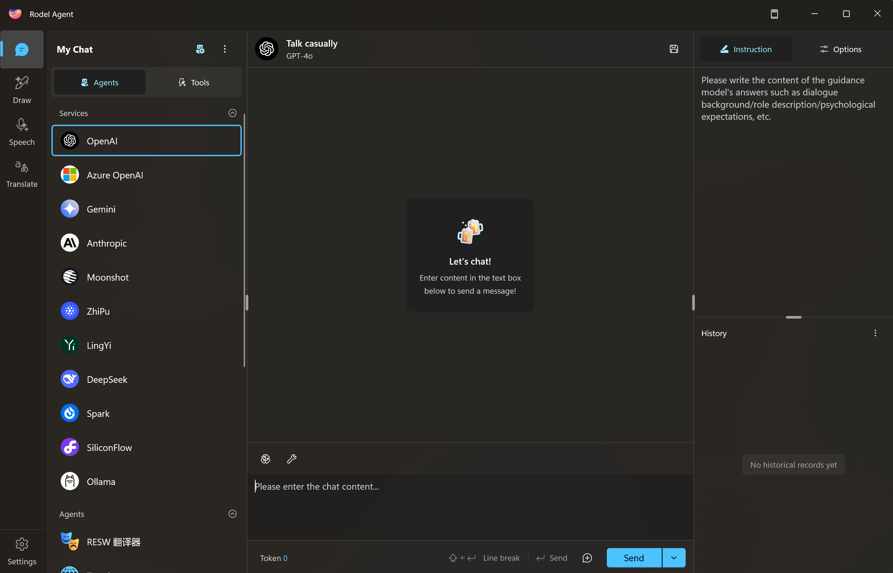
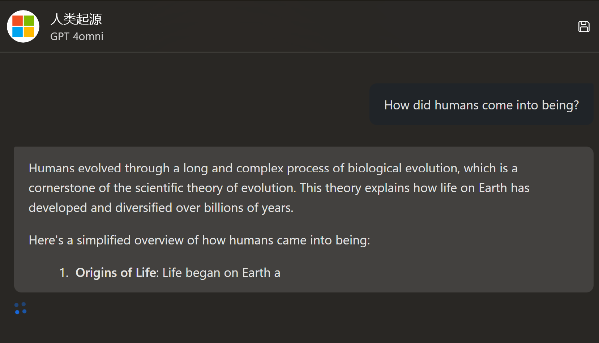
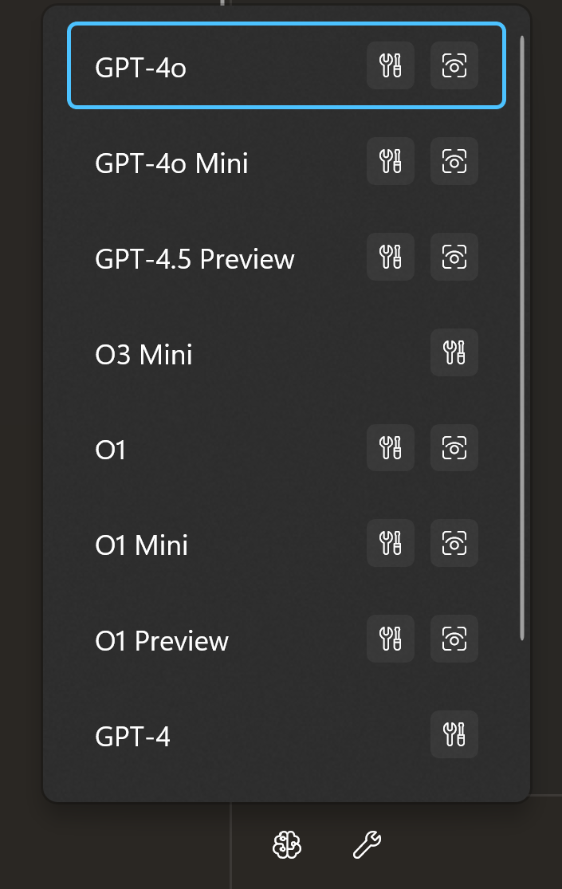
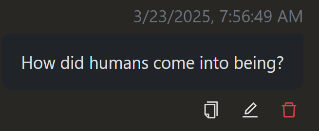
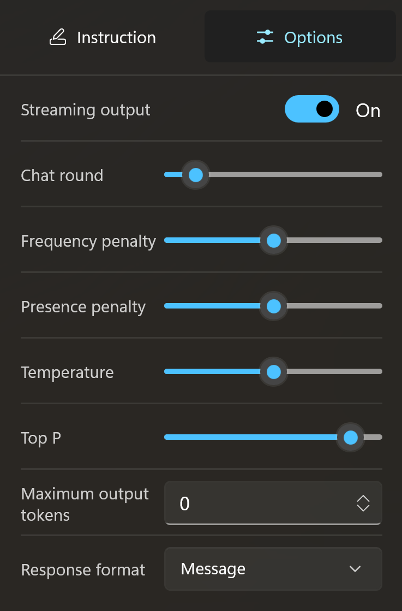

# Start Conversation

After completing the [Configuration of Chat Services](./chat-config), you can now access the chat interface from the sidebar.

## Quick Start

***Select an available AI service on the left, then start typing in the chat box to initiate a conversation with the AI.***

Next, let's briefly introduce the chat interface.

On the left side of the conversation interface, there are two main functional sections: `Agents` and `Tools`. Let's start with the Agent.

## Agent Panel

### Services

During conversation configuration, you may configure multiple AI services to meet different needs.

The application will display the configured AI conversation services on the left, allowing you to select a service and start the conversation.

### Agent

Besides the services, you can also call the agent.

For example, the `RESW Translator` shown in the screenshot is an AI agent specifically used for translating resw files.

If you want to learn more about agents, please read [AI Agent](./agent-preset).

### Groups

When you have two or more agents, you can gather them into a group, act as the leader, assign a goal, and brainstorm to make the models work collaboratively.

## Tools Panel

As AI has developed to this point, mainstream AI services and models generally support tool calling (Tool Call).

Unlike AI services deployed in the cloud, Rodel Agent, as a native Windows application, can conveniently run local code.

Therefore, Rodel Agent integrates the recently popular [Model Context Protocol (MCP)](https://docs.mcpcn.org/introduction), seamlessly integrating numerous MCP tools.

If you already have an MCP toolset, congratulations! You can directly import it into Rodel Agent for use.

## Chat Panel

When you select a `service` / `agent` / `group` from the left panel, the application will load the chat panel.

This interface should be familiar to you, as it resembles most chat tools we use daily.

You can input text at the bottom, press `Enter` to send, and wait for the AI response.

### Switching Models

AI services generally offer multiple models. If you wish to switch between different models, click the brain-like icon at the top left of the chat toolbar, and you can switch between different models.

### Message Tools

Rodel Agent supports individual operations on each message in the chat history.

Move the cursor over the message to see the message toolbar, where you can `copy` / `edit` / `delete`.

This helps you fine-tune the AI's output.

> [!DANGER]
> Note that some AI services have strict requirements for message history, requiring alternating user messages and AI messages (e.g., [Wenxin Yiyan](https://cloud.baidu.com/doc/WENXINWORKSHOP/s/clntwmv7t#body%E5%8F%82%E6%95%B0)). Deleting a message may cause AI service generation failure.

## Management Panel

On the right side of the interface is the management panel.

It is divided into two sections.

### Control Panel

The upper section is the control panel for the current session.

You can input system prompts here, or switch to `session options` to adjust AI behavior from a numerical perspective.

> [!TIP]
> Session options vary according to the current AI service. For "Open AI-like services," Open AI's parameter options are applied uniformly, but this does not mean all parameters will be processed correctly, which depends on the specific service's capabilities.

### Session History

The lower section of the management panel is the session list management.

Note that the session list here is not the entire session list but dynamically displays grouped lists based on the currently selected `service` / `agent` / `group`.

This means your chat sessions with Open AI will not appear in the session list for Azure Open AI.

This helps categorize sessions better and avoid confusion. However, it introduces a problem of indexing session records, which may be difficult.

Thus, a global session content search feature will be launched to solve this issue (TBD).

#### Rename Sessions

For a new session, its name is `Casual Chat`, but sometimes we don't want the list filled with Casual Chat.

To better manage historical sessions, we need to rename session titles.

You can right-click on a session, and the menu will offer two renaming options:

- Rename
- Smart Rename

Rename is self-explanatory; you can manually change the session title.

Smart Rename allows AI to write the title based on the first message in the session.

> [!TIP]
> During Smart Rename, the AI service used is the current chat AI service, so the accuracy of the title depends on the model's capabilities.
>
> Since session renaming itself is an AI call, it consumes tokens, hence it is manually triggered rather than automatically renamed.

If you find manual renaming too cumbersome, you can enable `Auto Rename Conversations` in settings.