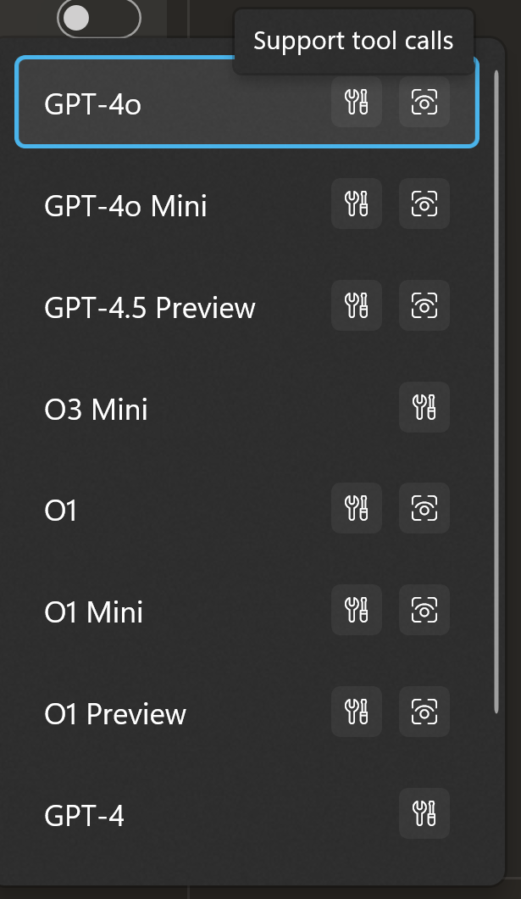
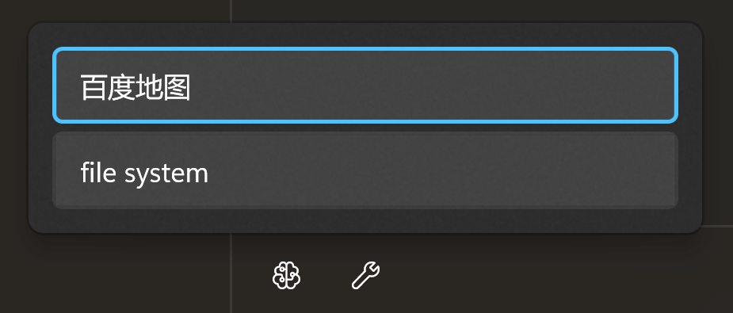

# Tool Usage

Rodel Agent supports a standard tool invocation process:

1. Send the prompt along with the toolset definition to the large language model.
2. The model determines whether to use the tool based on the prompt.
    - If needed, it returns the tool name.
        1. Invoke the specified tool (function).
        2. Return the result to the model.
        3. The model integrates the prompt and the tool invocation result to provide a response.
    - If not needed, it directly generates a response.
3. The application displays the final model response.

For example, you know that large language models typically do not have internet access and cannot answer real-time questions.

For example, what is the weather like in a certain city today?

However, the model can call a specified tool to obtain the latest weather information and then return the answer you need based on the weather information.

## Import Tool Plugins

In the Rodel Agent chat interface, you can find the import plugin feature in the overflow menu at the top of the left panel.

The plugin package for Rodel Agent is essentially a zip archive. For details on how to create one, please refer to [Plugin Development](./tool-dev).

After importing, a Plugins folder will be created in your working directory, containing the extracted plugin files.

## Model Support

Tool invocation requires model support. For example, in Open AI, GPT-3.5 Turbo supports tool invocation, but GPT-4 Vision Preview does not.

To check if a model supports tool invocation, ensure that the model has a tool icon.

For custom models, if you are sure that the model supports tool invocation, you can enable the tool invocation feature when creating it.

## Using Tools

In the chat interface, you need to switch to a model that supports tool invocation first, then click the button in the toolbar and check the plugins you need to use.

> [!TIP]
> In principle, you should not check too many plugins, as each plugin often contains multiple methods, and the descriptions of each method will also occupy the context window length.

Once the plugins are selected and the model supports tool invocation, you can start asking questions.

Assume your tool supports querying weather information. You can then ask questions like "What is the weather like in XXX today?", and the model will automatically call the tool to provide an answer.

