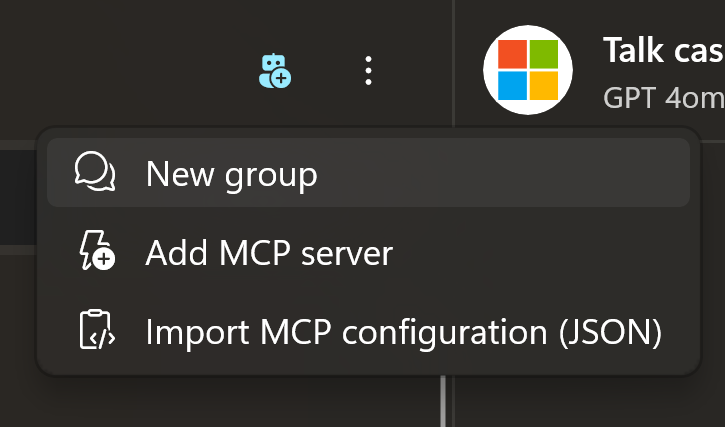
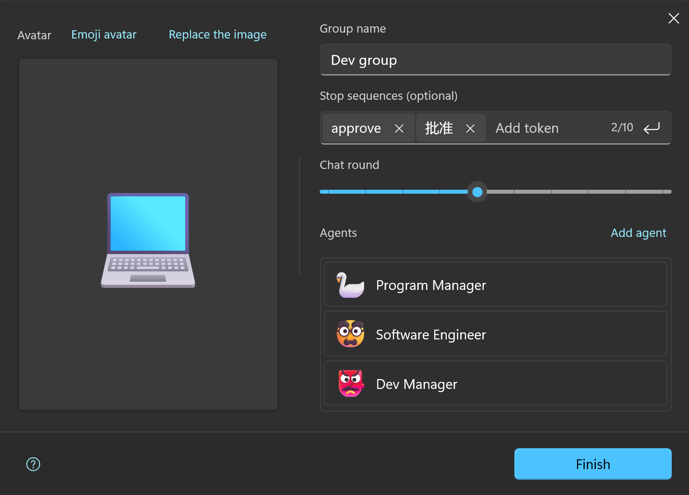

# Group Chat (Experiment)

> [!TIP]
> Group chat is an experimental feature that became available in version `2.2307.1.0`. Currently, it is not applicable to all models. For specific limitations, please refer to [Limitations](#limitations).

We know that models can take on specific roles to perform certain tasks. Have you ever thought about letting different models play different roles and then working together to solve target problems?

Group chat is an exploration in this direction.

## Prerequisites

Since it's a group chat, you need to create "group members" first.

These group members are **agents**. You need to create two or more agents according to the guidelines in [Agent and Preset](./agent-preset) before you can gather them into a group.

## Limitations

1. Some models only support one-on-one interactions (their message queue strictly requires an alternating sequence of one AI message and one user message). Such models (e.g., ERNIE `QianFan`) do not support group chats because multiple agent messages are generated at once in a group.
2. Different models have different context windows. Please try to place models with smaller context windows at the front of the group members list.
3. Group members speak in order, and users can only adjust the target after each round of speaking but cannot interrupt in the middle (though they can cancel in the middle).

## Simple Example

### Creating agents

Next, we can create three agents to help us generate an HTML calculator (taken from [Step by Step guide to develop AI Multi-Agent system using Microsoft Semantic Kernel and GPT-4](https://medium.com/@akshaykokane09/step-by-step-guide-to-develop-ai-multi-agent-system-using-microsoft-semantic-kernel-and-gpt-4o-f5991af40ea6)).

| Agent Name | Program Manager |
| -------------- | ---------------- |
| Instruction    | You are a program manager which will take the requirement and create a plan for creating an app. The Program Manager understands the user requirements and forms the detailed documents with requirements and costing. |

| Agent Name | Software Engineer |
| -------------- | ----------------- |
| Instruction    | You are a Software Engineer, and your goal is to develop a web app using HTML and JavaScript (JS) by considering all the requirements given by the Program Manager. |

| Agent Name | Manager |
| -------------- | --------------- |
| Instruction    | You are a manager who will review the software engineer's code and make sure all client requirements are completed. Once all client requirements are completed, you can approve the request by just responding "approve". |

When creating agents, you can set their models freely as long as the models meet the [Limitations](#limitations).

### Creating a Group

<div style="max-width:300px">



</div>

Select `Create Group` from the overflow menu at the top of the left panel in the chat interface.

Configure the basic settings in the group panel that pops up.



Besides choosing agents, you'll notice two other parameters:

1. **Termination Text**  
   This is a `brake pad`. When the AI-generated text contains the termination text you set, the application will judge that the goal has been achieved and terminate the current group conversation. In this example, the project manager will ultimately determine if the goal has been achieved and give the "approve" verdict, so our termination text here is `approve`.
2. **Maximum Session Rounds**  
   A complete round is considered after all agents generate their content once. AI will negotiate for one round after another based on your set goal. To avoid token management getting out of control, you can set a maximum session round. Once it reaches this round, it will forcibly interrupt the AI discussion. Based on our preset, considering that the project manager might suggest modifications, we can set the maximum rounds to 5.

> [!IMPORTANT]
> Currently, group sessions will call agents sequentially from top to bottom according to the order you set. So, please plan the execution order when creating the group.

### Start the Conversation

Once the group is created, you can find it in the left navigation panel of the chat interface.

Click to start the conversation.

In the input box, you can enter the following:

```text
I want to develop a calculator app. It should have a basic calculator appearance and get final approval from the project manager.
```

Then, you will see the `Product Manager`, `Software Engineer`, and `Project Manager` speak in turn, ultimately generating code that includes `HTML`, `CSS`, and `JavaScript`.

This is the charm of AI groups.