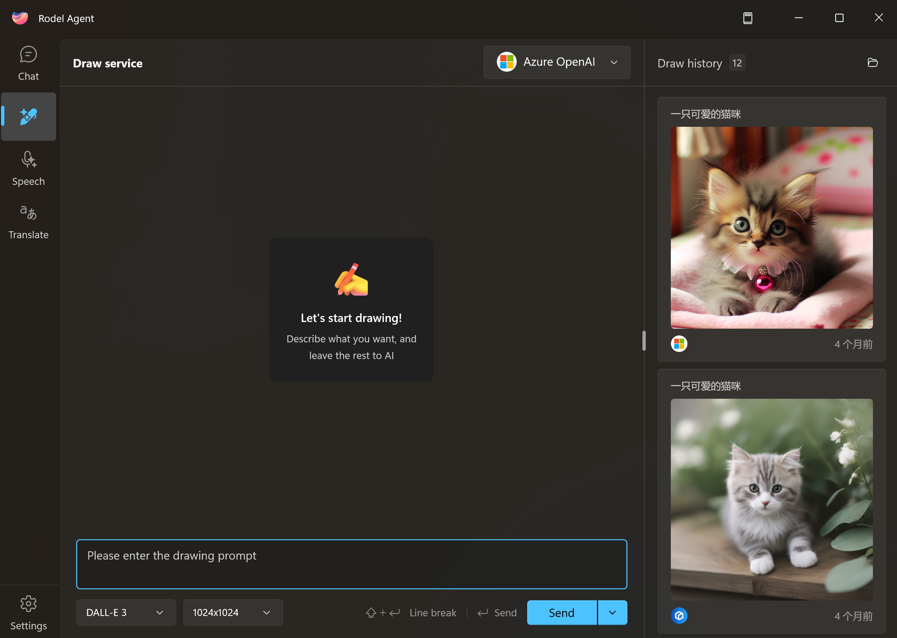

# Start Drawing

After completing the [image generation service configuration](./image-config), you can now enter the drawing interface from the sidebar.

## Basic Settings

The app simplifies the image generation configuration, and in the application, you only need to focus on three basic options:

1. Drawing prompts
2. Image size
3. Image model

### Drawing Prompts

Except for the Stable Diffusion XL model on Baidu Qianfan platform, other models support Chinese prompt input.

Each platform has its own prompt guidelines, but their understanding of natural language is generally not as strong as text models. So a basic rule is:

**Try to use phrases and reduce the use of rhetorical devices, describing what you want to draw in the simplest and most straightforward text.**

You can look for example prompts online to learn more about this.

### Image Size

Different models support different drawing sizes, and they are usually not infinitely adjustable.

Generally, the larger the size, the more resources it consumes. Please draw images according to your actual needs.

## Sessions and Image Management

In the app, each prompt you send is considered a new session (even if the prompt is the same).

Each session generates a unique image, which will be saved in the `Draw` folder in the working directory. The image name corresponds to the session ID.

> [!TIP]
> If you need to transfer images, please click on the corresponding image in the `Drawing History` within the application, and select `Save As` under the loaded image.