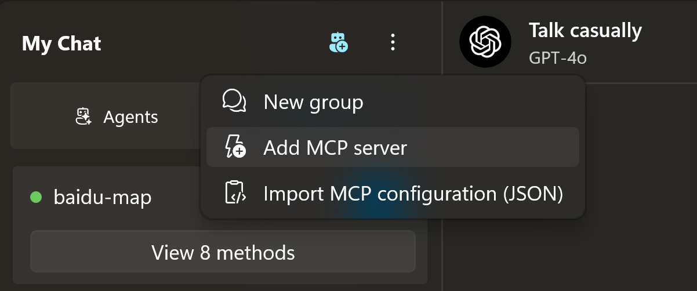
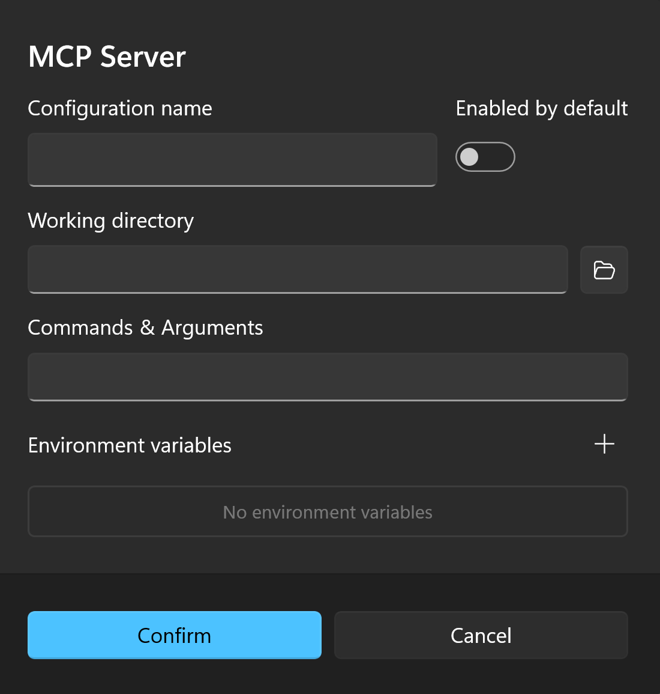
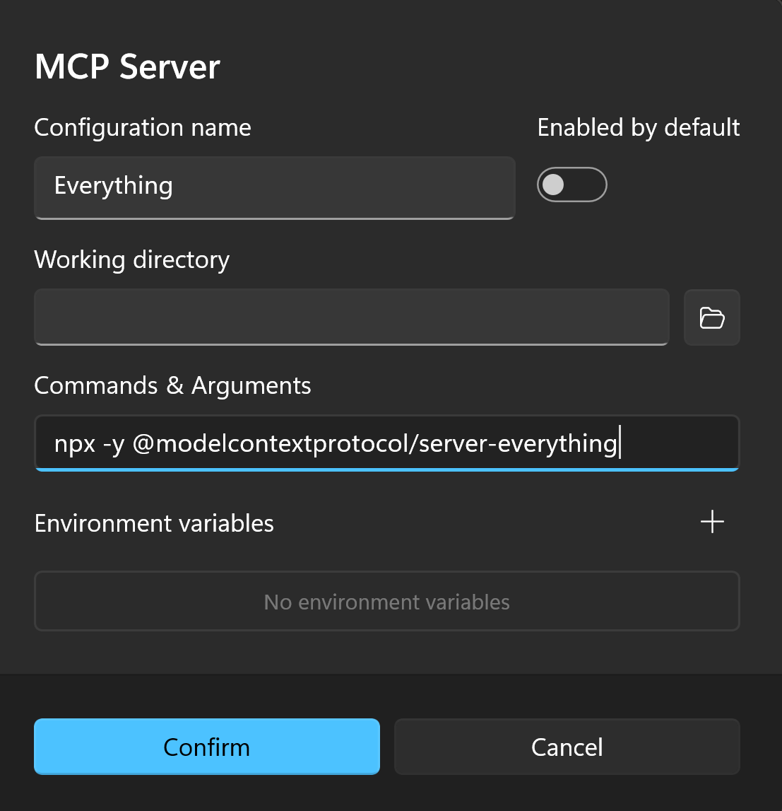
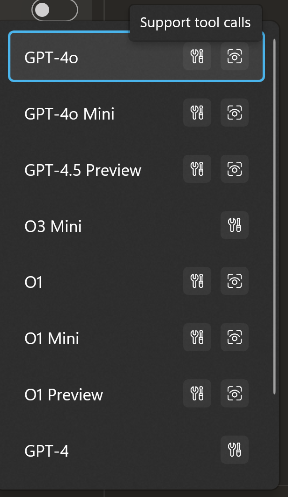
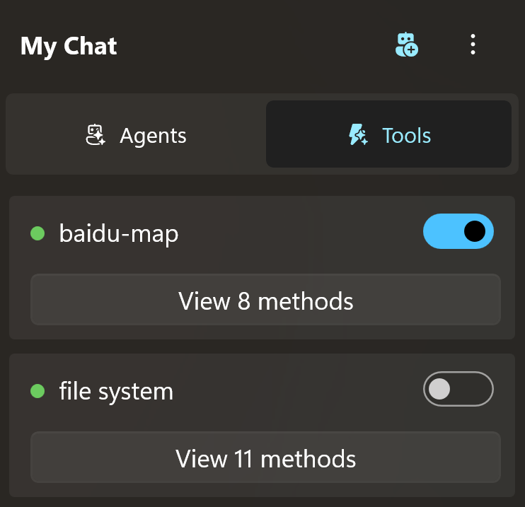
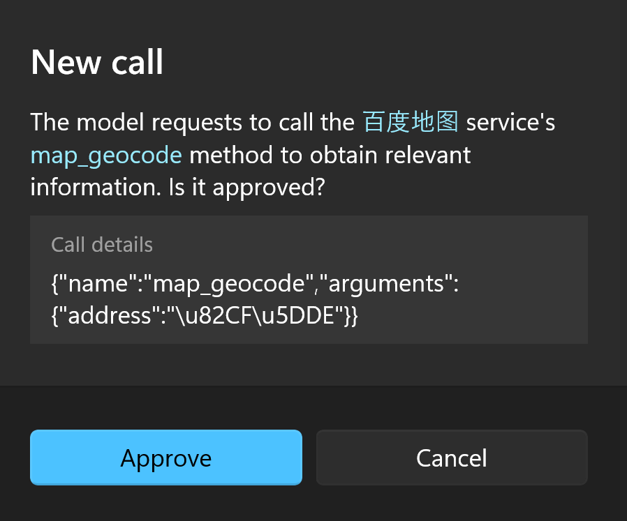
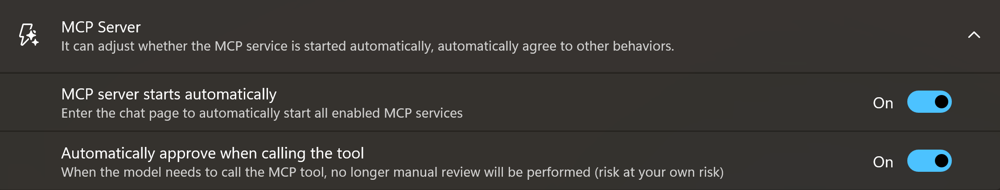

# MCP Integration

Rodel Agent supports the standard tool invocation process:

1. Send the prompt along with tool definitions to the large language model.
2. The model determines if a tool is needed based on the prompt.
    - If needed, it returns the tool name.
        1. The application invokes the specified tool (function).
        2. Return the value back to the model.
        3. The model synthesizes the prompt and the tool invocation result to provide a response.
    - If not needed, it directly generates a response.
3. The application displays the final model response.

For example, as you know, large language models typically do not have internet access and cannot answer real-time questions.

For example, what is the weather like in a certain city today?

But the model can call the specified tool to get the latest weather information and then return the answer you need based on the weather information.

## Integrate MCP

In the Rodel Agent chat interface, you can find the entry point for importing MCP servers in the overflow menu at the top of the left panel.

<div style="max-width:360px">



</div>

There are two ways to add servers here:

1. Manually add MCP servers.
2. Import existing MCP JSON configuration files.

### Manually Add MCP Server

Click `Add MCP server`, and you will see the following dialog:



Here we take the official example [Everything](https://github.com/modelcontextprotocol/servers/tree/main/src/everything) service as an example.

This is the configuration provided for Claude by the official:

```json
{
  "mcpServers": {
    "everything": {
      "command": "npx",
      "args": [
        "-y",
        "@modelcontextprotocol/server-everything"
      ]
    }
  }
}
```

In Rodel Agent, fill it in like this:



`Working Directory` and `Environment Variables` are only useful for individual servers. If your server does not need them, leave them blank.

### Import MCP Configuration File

If you are already using Claude Desktop or other applications that support MCP, you should already have a set of your own configuration files (JSON). You can directly import them into Rodel Agent, and Rodel Agent will automatically generate a list of MCP servers based on your configuration file.

Rodel Agent supports the following two configuration formats:

1. Claude Desktop Configuration

```json
{
    ... Other configurations
    "mcpServers": {
        "xxx": {
            "command": "xxx",
            ...
        },
        ...
    }
}
```

2. MCP Configuration List

```json
{
    "xxx": {
        "command": "xxx",
        ...
    },
    ...
}
```

## Model Support

Tool invocation requires model support. For example, in Open AI, GPT-3.5 Turbo supports tool invocation, but GPT-4 Vision Preview does not.

To check if the model supports tool invocation, please confirm that the model has a tool icon.

<div style="max-width:240px">



</div>

For custom models, if you confirm that the model supports tool invocation, you can check the tool invocation function when creating it.

## Using Tools

In the tool list, each tool has a switch that indicates whether the tool is enabled by default in the conversation.



If enabled by default, the definitions of these tools will be included when asking the model to determine whether to invoke these tools.

Meanwhile, in the chat interface, you can also expand the tool panel of the current session and manually select which tools to include.

<div style="max-width:300px">


</div>

> [!TIP]
> In principle, you should not select too many plugins, because often a plugin contains multiple methods, which may affect the model's hit rate.

Once the plugins are selected, and the model supports tool invocation, you can start asking questions.

If your tool supports querying weather information, you can ask questions like `What is the weather like today in XXX?`. If the model determines that it needs tool assistance, it will attempt to call the tool, but this requires your consent.



This is a conservative approach. When you are not familiar with tool invocation, you should know what the model is trying to do so that you can interrupt it in time if it goes off track.

If you have more trust in the model's judgment ability, you can enable `Automatically agree to tool invocation` in the settings.



In this way, the model will proceed with tool invocation according to its own rhythm.

