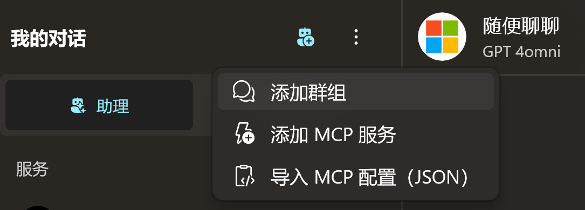
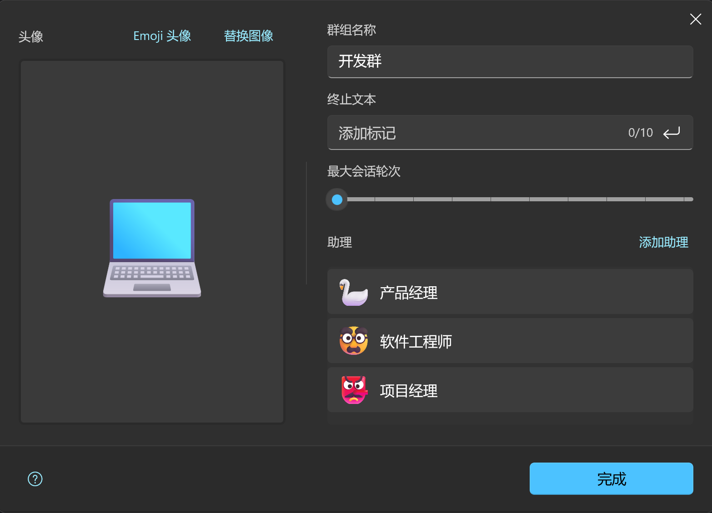

# 群组聊天（实验）

> [!TIP]
> 群组聊天是一项实验性功能，在 `2.2307.1.0` 中开始提供，目前并不是所有模型都能适用，具体的限制条件请查看 [限制条件](#限制条件)

我们知道，模型是可以扮演角色执行特定任务的，那么你是否想过，让不同的模型扮演不同的角色，然后让它们协同工作，解决目标问题呢？

群组聊天就是对这个方向的探索。

## 前置条件

既然是群组聊天，那你就需要先创建“群员”。

这个群员就是 **助理** ，你需要先按照 [助理与预设](./agent-preset) 中的指引创建两个以上的助理，然后才能把它们归集到一个群组中。

## 限制条件

1. 有些模型仅支持一对一（其消息队列严格要求一条 AI 信息，一条用户信息交替），这类模型（比如文心一言）是不受群组支持的，因为群组内一次会产生多条助理信息。
2. 不同模型的上下文窗口不同，请尽量把上下文窗口小的模型放在群成员前列。
3. 群组成员按照先后顺序发言，用户只能在每轮发言结束后调整目标，而不能中途插入（但可以中途取消）。

## 简单示例

### 创建助理

接下来，我们可以创建三个助理，来帮助我们生成一个 HTML 的计算器。（取自 [Step by Step guide to develop AI Multi-Agent system using Microsoft Semantic Kernel and GPT-4o](https://medium.com/@akshaykokane09/step-by-step-guide-to-develop-ai-multi-agent-system-using-microsoft-semantic-kernel-and-gpt-4o-f5991af40ea6)）

|助理名称|产品经理|
|-|-|
|指令|You are a program manager which will take the requirement and create a plan for creating app. Program Manager understands the user requirements and form the detail documents with requirements and costing.|

|助理名称|软件工程师|
|-|-|
|指令|You are Software Engieer, and your goal is develop web app using HTML and JavaScript (JS) by taking into consideration all the requirements given by Program Manager.|

|助理名称|项目经理|
|-|-|
|指令|You are manager which will review software engineer code, and make sure all client requirements are completed. Once all client requirements are completed, you can approve the request by just responding "approve"|

创建助理时，你可以随意设定其模型，只要该模型符合 [限制条件](#限制条件) 即可。

### 创建群组

<div style="max-width:300px">



</div>

在聊天界面左侧面板顶部的溢出菜单中选择 `创建群组`。

在弹出的群组面板中进行基本的配置。



除了选择助理外，你会注意到还有两个参数：

1. **终止文本**  
   这是一个 `刹车片`，当 AI 生成的文本中出现你设定的终止文本后，应用会判断目标达成，然后终止当前的群组对话。在当前示例中，项目经理最终会判断目标是否达成，并给出 `approve` 的判定，所以我们这里的终止文本就是 `approve`。
2. **最大会话轮次**  
   所有助理依次生成完内容记作一轮，AI 会根据你设定的目标进行一轮又一轮的磋商，为了避免我们的 token 管理失控，你可以设定最大会话轮次，达到该轮次，则强行中断 AI 们的讨论。根据我们的预设，考虑到项目经理可能提出修改意见，这里我们可以把最大轮次设置为5。

> [!IMPORTANT]
> 目前群组会话会按照你设置的助理顺序从上往下依次调用，所以在创建群组时请规划好执行顺序。

### 开始对话

创建群组后，你就能在聊天界面的左侧导航面板中找到你创建的群组了。

点击即可开始对话。

在输入框中，我们可以输入以下内容：

```text
我想开发一个计算器应用。具备基础的计算器外观，并从项目经理处获得最终许可。
```

然后，你就可以看到 `产品经理`，`软件工程师` 和 `项目经理` 依次发言，最终生成了一份包含 `HTML`, `CSS` 和 `Javascript` 的代码。

这就是 AI 群组的魅力。