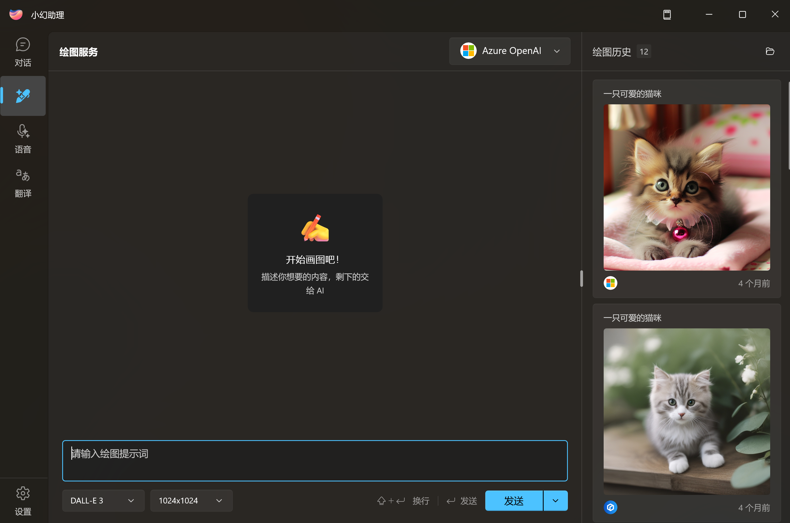

# 开始绘图

在完成 [文生图服务配置](./image-config) 之后，现在你可以在侧边栏进入绘图界面。

## 基础设置

小幻助理简化了文生图的配置，在应用中，你只需要关心三个基础选项：

1. 绘图提示词
2. 图片尺寸
3. 图片模型

### 绘图提示词

每家提示词都有各自的规范，但其对自然语言的理解能力普遍没有文本模型那么强，所以一个基本的规则就是：

**尽量使用短语，减少修辞手法的运用，以最简洁直观的文本描述你要画的内容。**

关于这一点，你可以在网上寻找样板提示词进行学习。

### 图片尺寸

不同的模型支持不同的绘制尺寸，它通常不是无级调节的。

一般来说，尺寸越大，耗费的资源就越多，请根据自己的实际需要来绘制图像。

## 会话及图片管理

在小幻助理中，每次发送提示词都视作是一个新的会话（即便提示词相同）。

每个会话生成的图片都是唯一的，会保存在工作目录的 `Draw` 文件夹内，图片名称就是对应的会话 ID。

> [!TIP]
> 如果你需要转存图片，请在应用内的 `绘图历史` 中点击对应的图片，在加载后的图片下方中选择 `另存为`。