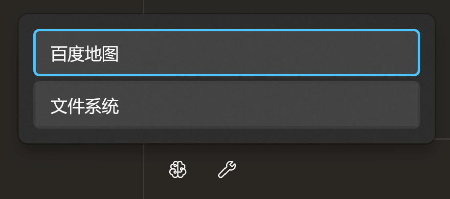
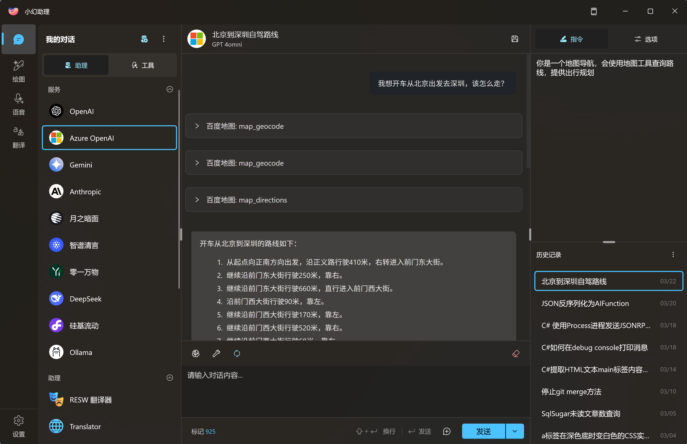

# MCP 集成

小幻助理支持标准的工具调用流程：

1. 将提示词与工具集定义一起发送给大语言模型。
2. 模型根据提示词判定是否需要使用工具。
    - 如果需要，则返回工具名称。
        1. 应用调用指定名称的工具（函数）
        2. 将返回值回传给模型
        3. 模型综合提示词和工具调用结果给出响应。
    - 如果不需要，直接生成响应。
3. 应用显示最终的模型响应。

举例来说，你知道的，大语言模型通常不具备联网能力，无法回答实时性问题。

比如今天某个城市的天气如何。

但是模型可以调用指定的工具去获取最新的天气信息，然后根据天气信息返回你需要的答案。

## 接入 MCP

在小幻助理的聊天界面，你可以在左侧面板顶部的溢出菜单中找到导入MCP服务的功能入口。

<div style="max-width:360px">


</div>

这里有两种添加方式：

1. 手动添加 MCP 服务
2. 导入现有的 MCP JSON 配置文件

### 手动添加 MCP 服务

点击 `添加 MCP 服务`，你能看到下面的这个对话框：


这里我们以官方示例的 [Everything](https://github.com/modelcontextprotocol/servers/tree/main/src/everything) 服务举例。

这个是官方提供的用于 Claude 的配置：

```json
{
  "mcpServers": {
    "everything": {
      "command": "npx",
      "args": [
        "-y",
        "@modelcontextprotocol/server-everything"
      ]
    }
  }
}
```

在小幻助理中就这样填写：


`工作目录` 和 `环境变量` 仅对个别服务有用，如果你的服务不需要，那就留空。

### 导入 MCP 配置文件

假如你已经在使用 Claude Desktop 或者其它支持 MCP 的应用，那么你应该已经有了一套自己的配置文件（JSON），你可以直接将其导入到小幻助理中，小幻助理会根据你的配置文件自动生成 MCP 服务列表。

小幻助理支持以下两种配置格式：

1. Claude Desktop 配置

```json
{
    ... 其它配置
    "mcpServers": {
        "xxx": {
            "command": "xxx",
            ...
        },
        ...
    }
}
```

2. MCP 配置列表

```json
{
    "xxx": {
        "command": "xxx",
        ...
    },
    ...
}
```

## 模型支持

工具调用需要模型支持，比如 Open AI 中，GPT-3.5 Turbo 支持工具调用，但是 GPT-4 Vision Preview 就不支持。

如果想查看该模型是否支持工具调用，请确认该模型具有工具图标。

<div style="max-width:240px">


</div>

对于自定义模型，如果你确认该模型是支持工具调用的，可以在创建时勾选工具调用功能。

## 使用工具

在工具列表中，每一个工具都有一个开关，这个开关表示是否在会话中默认启用该工具。


如果默认启用，那么在询问模型时会默认带上这些工具的定义，以便模型判断是否要调用这些工具。

同时，在聊天界面中，你也可以展开当前会话的工具面板，手动选择携带哪些工具。

<div style="max-width:300px">



</div>

> [!TIP]
> 原则上不应勾选太多的插件，因为往往一个插件中包含多个方法，可能会影响模型的命中率。

当插件勾选完成，且模型支持工具调用，那么你就可以提问了。

假设你的工具支持查询天气信息，那么你就可以问 `今天 XXX 天气怎么样？` 之类的问题，如果模型判断需要工具辅助，那就会尝试调用工具，但这需要你的同意。


这是一种保守的做法，当你对工具调用不熟悉的时候，你最好知道模型正在尝试做什么，以便在它跑偏的时候及时打断它。

如果你对模型的判断能力比较信任，那么你可以在设置里开启 `调用工具时自动同意`。


这样，模型就会按照它的节奏来进行工具调用了。

